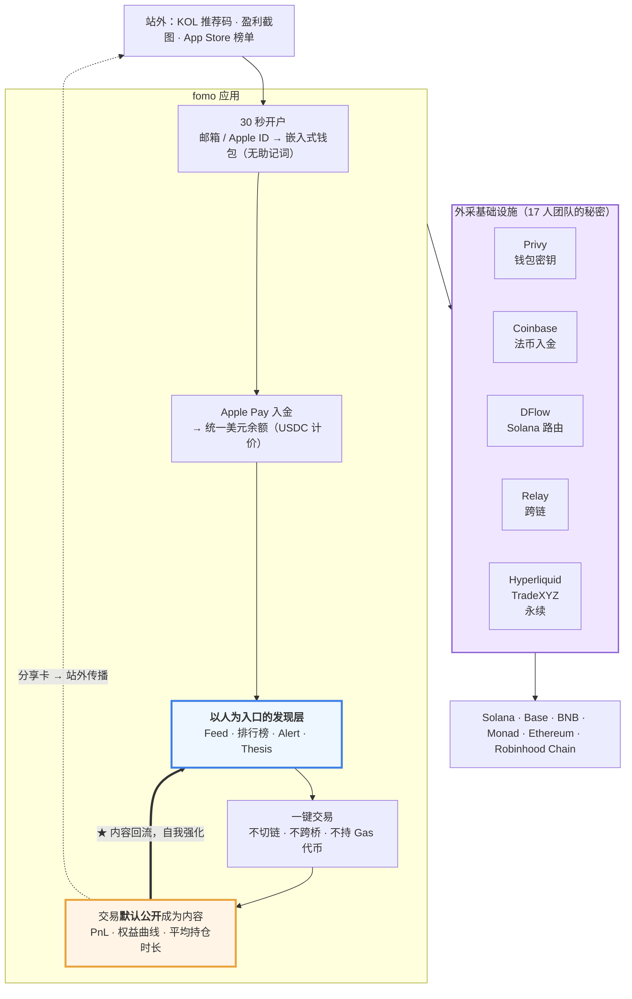
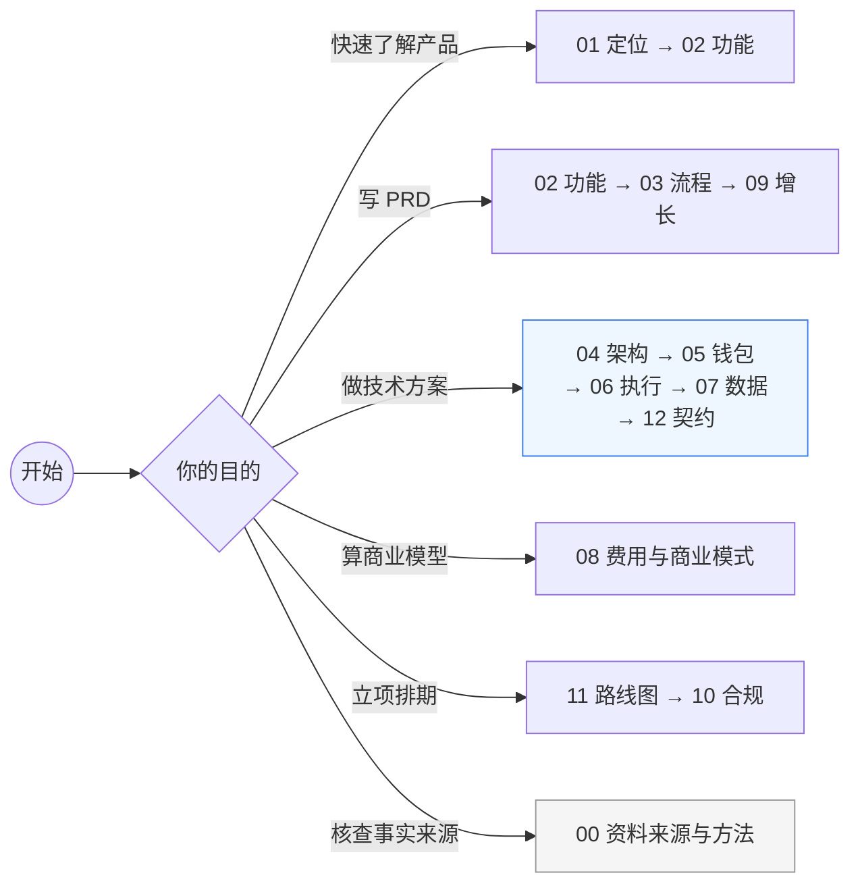
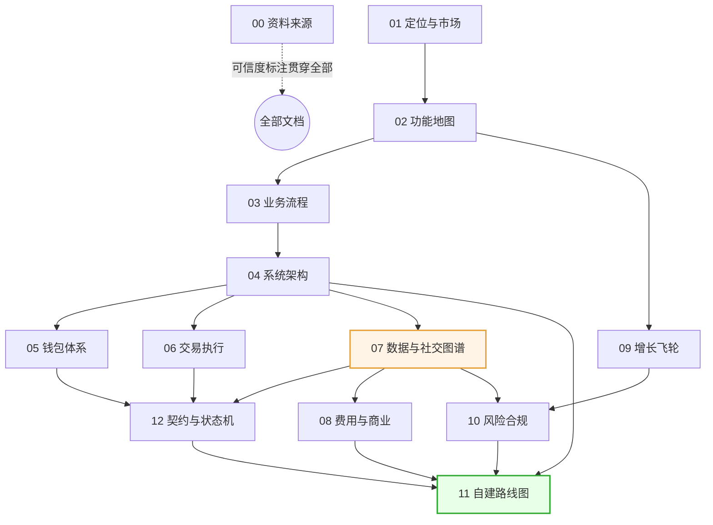

# fomo_learn

拆解 [fomo.family](https://fomo.family/)（社交化链上交易 App，运营方 FOMO Labs, Inc.）的产品形态、业务流程与系统架构，作为自建同类交易平台的设计输入。

> 文档基于 **公开资料** 整理，截止日期 **2026-09-23**。fomo 未公开后端代码与内部架构，本仓库中标注为「推断」的部分是基于其公开描述、合作方技术文档与行业通行做法做的工程复原，不代表其真实实现。

---

## 这是什么产品

一句话：**把交易做成 Feed 的自托管多链交易 App**。

用户用邮箱 / Apple ID 登录即生成嵌入式钱包（无助记词），用 Apple Pay 入金得到一个以 USDC 计价的统一美元余额，然后在一个「谁买了什么」的社交信息流里发现资产并一键下单 —— 不切链、不跨桥、不持有 Gas 代币。

与传统交易终端的根本差异在**入口的组织方式**：别的产品以搜索框和 K 线为起点，fomo 以**人**为起点（详见 [Galaxy 关于社交交易的研究](https://www.galaxy.com/insights/research/social-trading-fomo)，内容经改写以符合授权要求）。

## 一张图看懂

## 关键数字（fomo 官方 / 媒体披露）

| 指标 | 数值 | 时点 |
|---|---|---|
| 注册用户 | 190 万+ | 2026-08-31 |
| 月活用户 | 120 万+ | 2026-08 |
| 日新增 | 3 万+ | 2026-08 |
| 月交易量 | $500M → $1.5B → $2.8B+ | 2026-06 / 07 / 08 |
| 月收入 | ~$17M（年化 $200M+） | 2026-08 |
| 累计融资 | ~$94M（估值 $550M） | 2026-06 |
| 团队规模 | ~17 人（Series B 时） | 2026-06 |

17 人撑起年化 2 亿美元收入 —— 这个比例本身就是架构结论：**执行层几乎全部外采，自研集中在社交图谱、数据与客户端体验**。

## 文档索引

| 文档 | 内容 |
|---|---|
| [00 资料来源与方法](docs/00-资料来源与方法.md) | 全部引用来源、可信度分级、哪些是推断 |
| [01 产品定位与市场](docs/01-产品定位与市场.md) | 解决什么问题、目标用户、竞品象限、发展时间线 |
| [02 功能模块地图](docs/02-功能模块地图.md) | 全部功能模块拆解与优先级 |
| [03 核心业务流程](docs/03-核心业务流程.md) | 12 条主流程的分步时序（开户/入金/交易/社交/出金/Perps） |
| [04 系统架构拆解](docs/04-系统架构拆解.md) | 分层架构图、自研 vs 外采边界、服务划分 |
| [05 账户与钱包体系](docs/05-账户与钱包体系.md) | 嵌入式钱包、Shamir 分片、TEE 签名、ERC-4337 |
| [06 交易执行与跨链](docs/06-交易执行与跨链.md) | 路由、聚合、跨链、Gas 代付、Perps 接入 |
| [07 社交图谱与数据体系](docs/07-社交图谱与数据体系.md) | 数据模型、PnL 计算、Feed 排序、排行榜、索引管道 |
| [08 费用结构与商业模式](docs/08-费用结构与商业模式.md) | 费率、单位经济、收入构成、Gas 代付成本 |
| [09 增长飞轮与运营机制](docs/09-增长飞轮与运营机制.md) | Referral / Clans / Trader Rewards / KOL 分发 |
| [10 风险合规与安全](docs/10-风险合规与安全.md) | 非托管边界、KYC、地域限制、代币风控、诈骗防护 |
| [11 自建路线图与技术选型](docs/11-自建路线图与技术选型.md) | MVP 拆分、技术选型建议、里程碑与人力估算 |
| [12 接口与数据契约草案](docs/12-接口与数据契约草案.md) | REST/WS 接口清单、事件契约、枚举与状态机、幂等与一致性约定 |

## 阅读路径

所有文档的交叉引用关系：

> 图表全部使用 Mermaid，GitHub 网页端可直接渲染。本地预览需要支持 Mermaid 的 Markdown 插件（VS Code 可装 Markdown Preview Mermaid Support）。

## 免责声明

本仓库仅作技术与产品研究用途，不构成投资建议，也不构成对 FOMO Labs, Inc. 任何产品的推荐。文中所引用的第三方内容均已改写并标注来源链接。加密资产波动剧烈，Memecoin 绝大多数最终归零。
