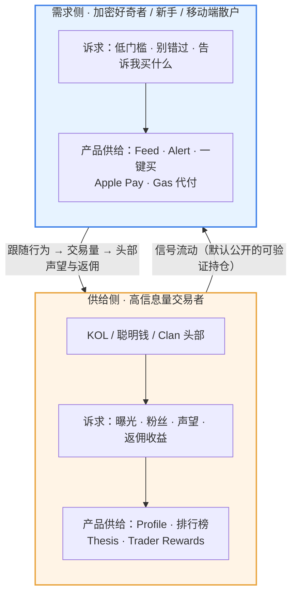
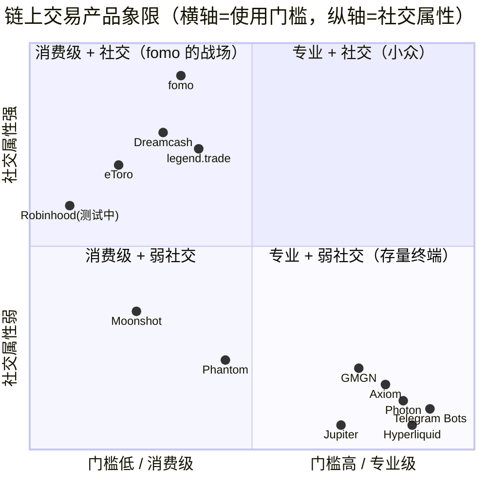
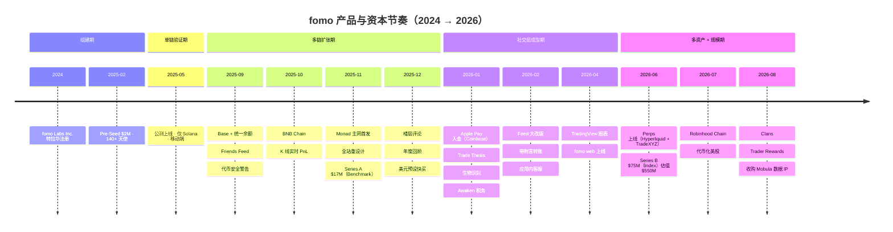
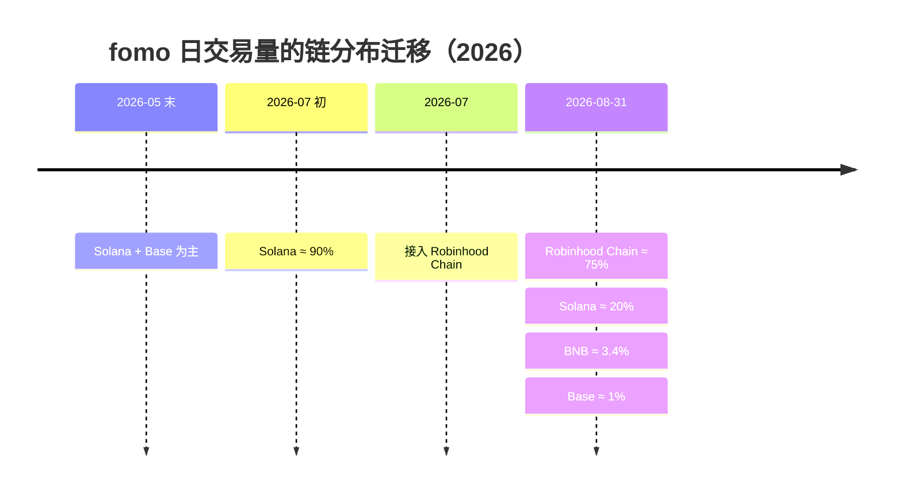
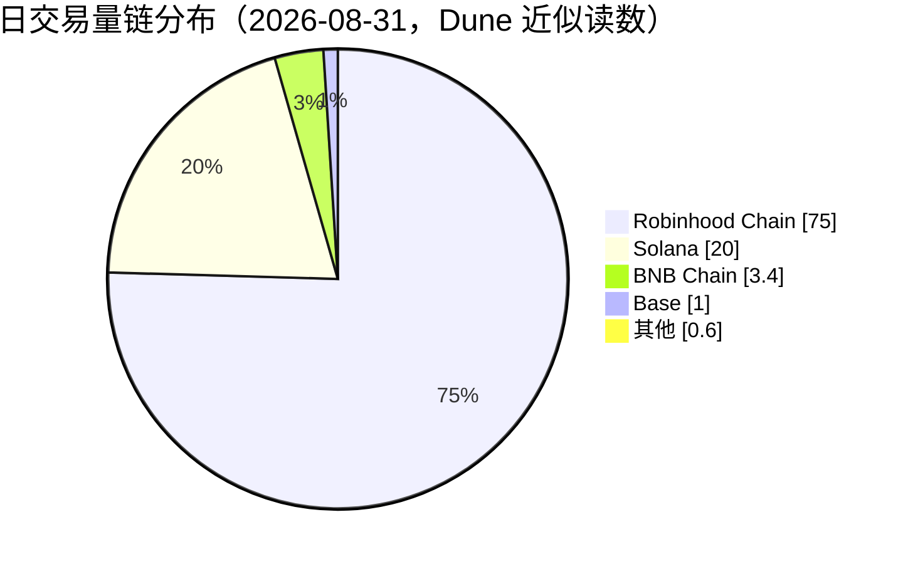

# 01 · 产品定位与市场

## 1. 它解决的是「接口问题」，不是「金融问题」

这是理解 fomo 的第一个关键点，也是自建同类产品最容易搞错的地方。

链上投机的**金融原语早已成熟**：Memecoin（Pump.fun 把发币成本压到近乎零）、永续合约（Hyperliquid）、预测市场（Polymarket）。这些原语覆盖了几乎所有表达观点的方式。**没有跟上的是使用体验** —— 想用好它们，你得同时开着交易终端、钱包追踪器、Telegram bot 和 X 信息流，在几条链之间来回切换。

Galaxy 的研究把这件事说得很直白：愿意配置一套高级交易终端的人数存在硬上限，而愿意下载一个社交 App 的人数要大得多（[来源](https://www.galaxy.com/insights/research/social-trading-fomo)，内容经改写）。fomo 联创 Se Yong Park 的原话是他们想做「能对任何东西下注的最好的地方」。

所以 fomo 的产品定位不是「更好的 DEX」，而是：

> **在已经成熟的链上金融原语之上，重建一个以人为组织单位的消费级接口层。**

这决定了它的一切取舍 —— 包括为什么它敢把执行层几乎全部外包。

## 2. 它拆掉的五道门槛

fomo 官方博客《What is fomo?》把行业摩擦点归为五类，对应到产品设计：

| 摩擦点 | 传统链上体验 | fomo 的解法 |
|---|---|---|
| **入金（Funding）** | 注册 CEX → KYC → 银行卡 → 提币 → 跨链桥 | Apple Pay / Google Pay / 借记卡一步到账，USDC 统一余额 |
| **发现（Discovery）** | 自己刷 X、Telegram、Dune，或听 KOL 喊单 | Feed + 排行榜 + Alert，**看真实持仓而非截图** |
| **碎片化（Fragmentation）** | 多链多钱包多 Gas 代币 | 一个账户一个余额覆盖六条链，Gas 由平台代付 |
| **诈骗（Scams）** | Rug、蜜罐、假币、内盘、未披露推广 | 代币安全标记、持仓分布、流动性提示 |
| **教育（Education）** | 分散且质量差 | 应用内 thesis、日报、newsletter、年度回顾 |

自建时要注意：**这五项里前三项是工程问题，后两项是运营 + 数据问题**。前三项能靠外采基础设施在 3 个月内做出来，后两项是长期护城河。

## 3. 核心机制：把「可验证的持仓」当作社交内容

这是 fomo 最有价值的产品洞察。

在 X 上，KOL 可以只晒赢单、藏掉输单，你无法验证。在 fomo 上，**通过平台执行的交易默认公开**，带入场价、仓位大小、实时 PnL 和已实现盈亏，还能附一段说明理由的文字（叫 **Thesis**，直接画在 K 线图上）。

关键差别在默认值：
- **Robinhood 的社交层是 opt-in**（用户自己选择要不要公布）→ 结果是「表演性展示」，晒的都是赢单
- **fomo 的社交层是 default-public**（默认全公开）→ 结果是「完整的交易行为画像」，包括亏损

insights4.vc 给这个机制下了一个更准确的定义，值得原样理解（措辞已改写）：fomo 构建的是**经过认证的行为图谱**，而不是完整的财务身份系统。它能证明「这个账户通过 fomo 开了这个仓」，但不能证明「这个人的全部仓位就是这些」—— 交易者完全可以在别的钱包建仓、在 fomo 上买入做信号、然后从隐藏钱包出货。

**这个边界必须在产品里讲清楚**，否则就是在制造系统性的误导。详见 [10 风险合规与安全](10-风险合规与安全.md#5-社交交易特有的风险)。

## 4. 目标用户与双边结构

fomo 同时服务两类人，这是它的张力所在：

⚠️ 注意这两条边是**双向**的，且第二条边正是风险的来源：需求侧的跟随行为本身在为供给侧创造收益（见 [10 风险合规与安全](10-风险合规与安全.md#5-社交交易特有的风险)中的「出货流动性」）。

支撑双边结构成立的一个数据点：2025-11 融资时披露 **12 万用户中有 3.5 万交易者（约 29%）**，另有约 1.5 万是纯新增加密用户。到 2026-06，**6.8 万人是第一次买加密资产（通过 Apple Pay，合计 $25M）**。

但要清醒：insights4.vc 指出 fomo **从未公开按加密原住民 / 大众用户切分过交易量、余额和留存**，所谓双边网络目前只是「战略上说得通」，而非「数据上被证明」。fomo CEO 自己也承认产品的交易属性仍远重于社交属性。

## 5. 竞品象限

**象限 2（消费级 + 强社交）目前很空** —— 这是 fomo 的位置，也是它增长最快的原因。Robinhood 正在从左下往上移动，这是最值得警惕的竞争方向。

逐个对比：

| 竞品 | 优势 | fomo 的差异点 |
|---|---|---|
| **Axiom / GMGN / Photon** | 狙击、捆绑钱包检测、限价单、更细的执行控制 | 费率更低（0.5% vs 0.7–1% 且 Gas 自付）、有社交层、有法币入口 |
| **Phantom** | 传统助记词、更广的 DeFi 连接性、Perps 同样 0.05% builder fee | 更快的开户、社交发现层；牺牲了 DeFi 通用性 |
| **Moonshot** | 法币通道覆盖更广、支付方式更多 | 公开 PnL + 排行榜 + Thesis；费率对小单更友好（Moonshot 是阶梯式，小单更贵） |
| **中心化交易所** | 受监管、KYC、账户恢复、部分地区有存款保护 | 新币上线速度（链上流动性，分钟级）、无 KYC、自托管 |
| **Robinhood** | 受监管的多资产券商、正在测试社交功能 | 社交默认公开 vs opt-in；链上资产覆盖 |

**关键判断**：执行层已经商品化（任何人都能在现有轨道上搭一个交易前端），竞争面上移到了**分发与发现**。社交图谱在这两件事上比订单簿强 —— 这是 fomo 的全部赌注。

## 6. fomo 自己承认的短板

做对标产品时这些是机会点：

- **现货没有限价单和止损单** —— App Store 近期评论里呼声最高的需求
- **没有狙击功能、没有捆绑钱包检测** —— 终端用户仍需另开一个终端
- **卖出偶发延迟** —— 多个来源提到波动剧烈时卖单失败，尤其是薄流动性代币
- **费用透明度差** —— 官网写了费用说明页但不写具体费率，只在服务条款里
- **$0.95 最低费** —— $10 的单子光显性费用就 9.5%，小额交易极不经济
- **Feed 被设计来促使你行动** —— 这既是产品点也是危险点
- **US 用户不能用 Perps 和股票代币** —— 砍掉了很大一块潜在受众

## 7. 发展时间线

明细（来自官方博客每月更新日志与融资公告，**[官方]**，除标注外）：

| 时间 | 事件 |
|---|---|
| 2024 | fomo Labs Inc. 在特拉华州注册 **[三方]** |
| 2025-02-18 | Pre-Seed $2M，140+ 天使（含 Balaji Srinivasan、Raj Gokal、Marc Boiron） |
| 2025-05-06 | **公测上线**：iOS + Android，**仅 Solana**，移动端优先 |
| 2025-09 | Base 全量支持、Friends Feed、精选代币板块、**代币安全警告**、多链排行榜 |
| 2025-10 | BNB Chain、K 线图上的实时 PnL、全持仓者可评论、Feed 关注开关 |
| 2025-11-06 | Series A $17M（Benchmark 领投），累计 $19M |
| 2025-11 | **Monad 主网首发**、App 整体重设计、新 K 线周期、评论表情、互关系统 |
| 2025-12 | 楼层式评论回复、年度回顾、**美元预设金额快买** |
| 2026-01 | **Coinbase Apple Pay 入金**、Awaken 税务集成、生物识别安全、**Trade Thesis** |
| 2026-02 | Feed 大改版、带附言/图片的转账、Thesis 进入全局 Feed、代币筛选器、应用内客服 |
| 2026-04-14 | **TradingView 图表集成** |
| 2026-04-29 | **fomo web 上线**（fomo.family 桌面版） |
| 2026-06-11 | **Perpetuals 上线**（Hyperliquid + Trade[XYZ]） |
| 2026-06-22 | Series B $75M（Index Ventures 领投，USV + Benchmark 跟投），估值 $550M |
| 2026-07 | **Robinhood Chain 支持**，代币化美股（AAPL/TSLA/NVDA）进入同一 Feed **[三方]** |
| 2026-08 | **Clans 上线**（8 月落地，9-01 开放邀请，当时 150+ 个 Clan）**[三方]** |
| 2026-08-28 | **Trader Rewards** 发布（内容驱动交易可获奖励）**[三方]** |
| 2026-08-31 | **收购 Mobula 软件与 IP**（Axios 引 CEO 称 $17M），核心团队加入 |

### 时间线里的三个结构性拐点

1. **2025-09 从单链变多链** —— 统一余额是产品从「Solana Memecoin App」升级为「交易平台」的分水岭。
2. **2026-06 上 Perps** —— 从现货变成多资产类别，也第一次让社交图谱跨越资产类型（同一个 Feed 里既有 Memecoin 也有 SpaceX pre-IPO 永续）。
3. **2026-08 收 Mobula 把数据自研** —— 从「纯接口层」转向「掌握数据基础设施」。这是对「执行层商品化、竞争上移」这个判断的必然反应：当日活从几千涨到十万以上、同时要覆盖 Solana/Robinhood Chain/BNB 等多网络时，**链上数据的延迟与稳定性变成了核心瓶颈**（[Odaily 分析](https://www.odaily.news/en/post/5212823)，内容经改写）。

### 交易量的链分布迁移（2026，Dune 数据 **[三方]**）

2026-08-31 的快照：

⚠️ 这些是从图表最新柱区间读出的近似比例，每日会随行情波动，不应视为长期固定份额。

**结论**：fomo 的交易量高度跟随链上热点迁移。这说明它的价值不在「深耕某条链」，而在**能快速接入新链并把流量导进去**。自建时，「新链接入的工程成本」应当是一个核心架构指标 —— 理想状态是配置化接入，而非每条链重写一遍。

---

> 本文档中对第三方内容的引用均已改写以符合授权限制（Content was rephrased for compliance with licensing restrictions）。
