# 03 · 核心业务流程

本文档拆解 12 条主流程。每条流程标注**用户可见步骤**与**系统后台动作**，后者多为 **[推断]**，基于合作方文档与行业通行实现。

---

## 流程总图

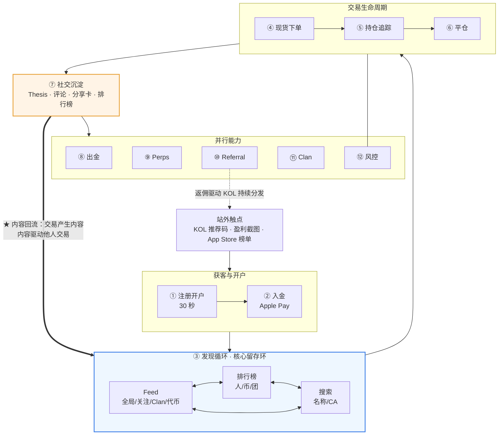

**注意这个图的形状**：它不是漏斗，是**闭环**。③→④→⑦→③ 是自我强化的 —— 用户交易产生内容，内容驱动他人交易。这是 fomo 全部产品设计的中心。

---

## ① 注册开户

**目标：30 秒内从零到可交易账户。**

| # | 用户动作 | 系统动作 |
|---|---|---|
| 1 | 打开 App / Web | 检查地域，决定是否隐藏 Perps 与股票代币入口 |
| 2 | 点「用 Apple ID 继续」或输入邮箱 | 走 OIDC / 邮箱 OTP 认证 **[推断]** |
| 3 | （邮箱）输入验证码 | 校验，创建平台 user 记录 |
| 4 | — | **调用 Privy 创建嵌入式钱包**：生成密钥 → Shamir 分片 → 分发存储（详见 [05](05-账户与钱包体系.md)） **[官方确认用 Privy + Shamir]** |
| 5 | — | EVM 链上部署 / 预计算 ERC-4337 智能账户地址 **[推断]** |
| 6 | 设置用户名、头像 | 建立社交图谱节点 |
| 7 | 开启 FaceID | 绑定设备生物识别（**按设备生效**，不是按账户） |
| 8 | 填推荐码（可选） | 建立 referral 关系，打上 -10% 费率标记 |
| 9 | 落到 Feed | 冷启动：推排行榜头部交易者 + 热门代币 **[推断]** |

时序：

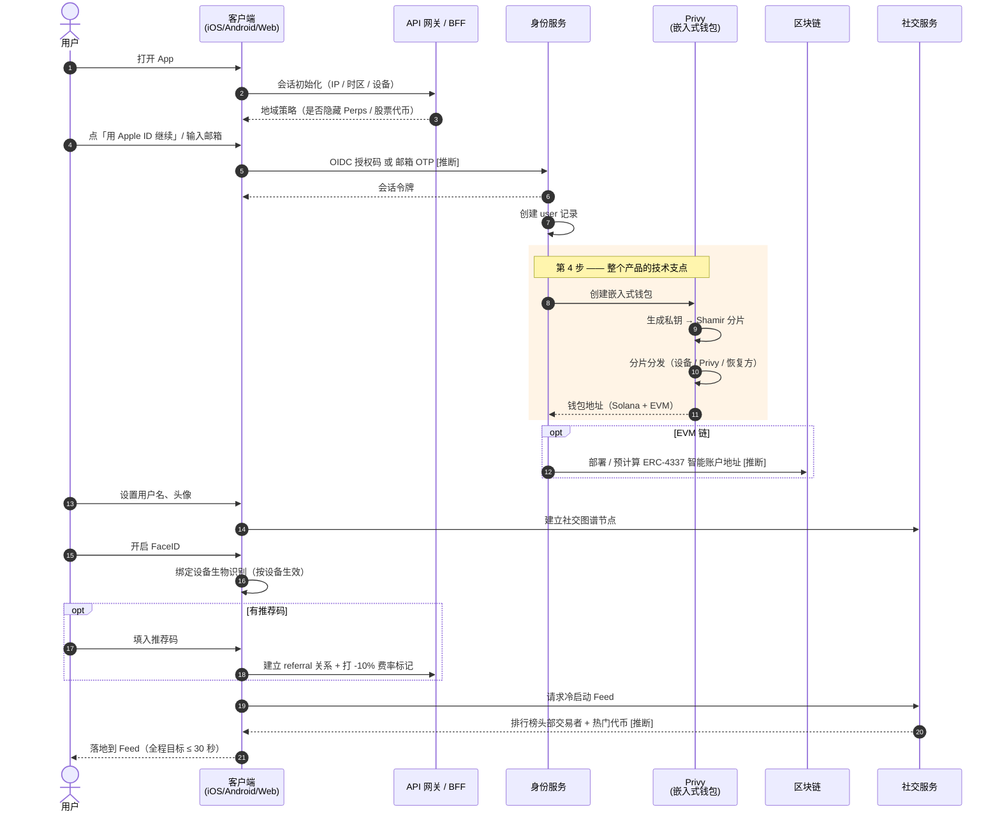

### 设计要点

- **第 4 步是整个产品的技术支点**。没有嵌入式钱包，这条流程至少要多 5 步（装钱包 / 抄助记词 / 验证 / 授权连接 / 买 Gas）。
- **没有 KYC**。fomo 自身不做身份验证，合规压力转移到支付合作方（法币入金环节）。这是它能做到 30 秒开户的另一半原因。
- **第 9 步的冷启动质量决定次日留存**。新用户此刻没有关注任何人，Feed 是空的 —— 必须用排行榜内容填满。

---

## ② 入金

### 2A · 法币入金（新用户主路径）

| # | 用户动作 | 系统动作 |
|---|---|---|
| 1 | 点「充值」→ 选 Apple Pay | 调起 Coinbase Onramp **[官方]** |
| 2 | 输入美元金额 | 返回报价（含支付方费用） |
| 3 | FaceID / 指纹确认 Apple Pay | 支付方处理扣款 + **自行做 KYC / 风控检查** |
| 4 | 等待 | 支付方在目标网络铸造 / 划转 **USDC 到用户嵌入式钱包地址** |
| 5 | 看到美元余额 | 索引到账事件，更新余额，推送通知 **[推断]** |

时序 —— 注意 **KYC 责任完全落在支付方**，这是平台能做到「交易无 KYC」的关键：

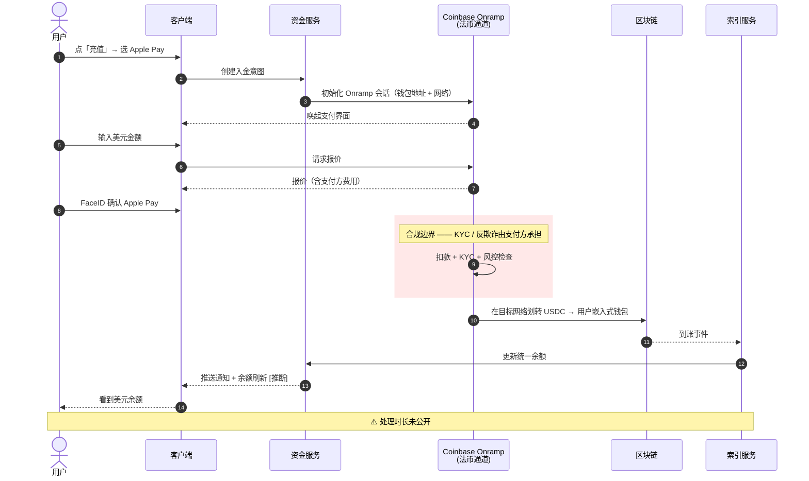

### 2B · 加密入金

| # | 用户动作 | 系统动作 |
|---|---|---|
| 1 | 点「加密充值」 | 展示钱包地址 + **支持的网络清单** |
| 2 | 选网络、复制地址 | — |
| 3 | 从外部钱包 / CEX 转 USDC 过来 | 监听地址入账事件 |
| 4 | 到账 | 更新统一余额 |

⚠️ 官方充值说明**指定 USDC**。转入其他资产的处理方式未公开文档说明。

### 关键设计：为什么用 USDC 作可见余额

1. 消费者心智：余额 = 美元 = 现金
2. PnL 用美元表达，不需要「用 SOL 计价的收益」这种反直觉概念
3. 彻底消除「为付 Gas 而持币」
4. 跨链统一计价的天然基准

⚠️ 代价：引入稳定币脱锚风险、发行方风险；且**每笔交易都隐含一次 USDC ↔ 目标资产的兑换**，路由质量直接决定用户实际成本。

---

## ③ 发现循环（核心留存环）

这是 fomo 区别于所有竞品的地方，也是最该抄的部分。

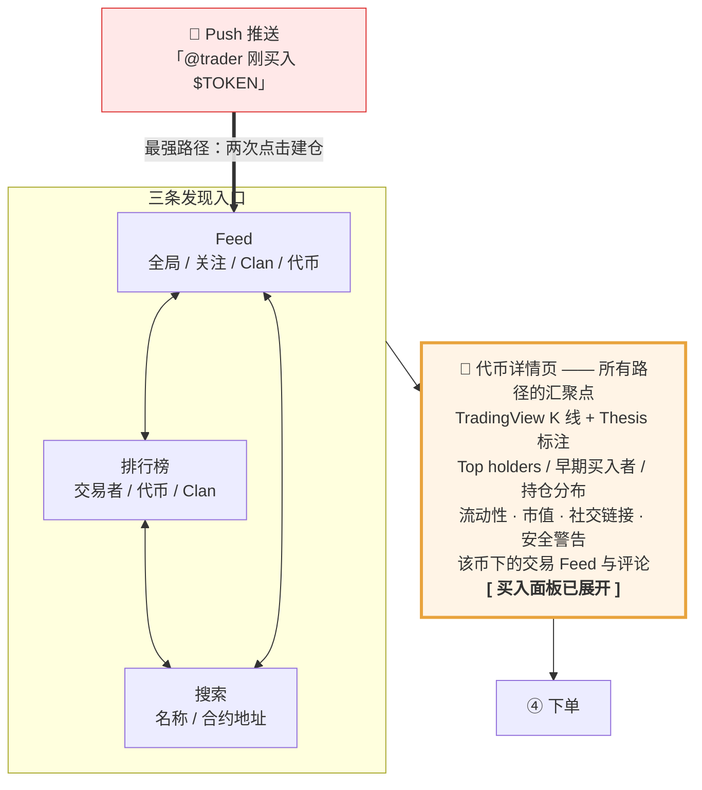

### 三条入口路径的转化特性

| 路径 | 触发方式 | 转化率 | 风险 |
|---|---|---|---|
| **Push → Feed 条目 → 代币页** | 被动（最强） | 最高，两次点击建仓 | 最容易产生无信息跟风 |
| **排行榜 → 交易者主页 → 关注** | 主动探索 | 中，但建立长期关系 | 头部集中、盲目崇拜 |
| **搜索 CA → 代币页** | 主动（老手） | 高 | 假币、钓鱼合约 |

### 代币详情页是整个产品的心脏

它必须在一屏内回答用户全部的 DYOR 问题，否则用户会跳出去开别的工具 —— 而一旦跳出去，这个平台就退化成了一个下单器。

页面必备元素（**[官方]**）：
- TradingView K 线 + **Thesis 时间戳标注画在图上**
- Top holders / 早期买入者 + 各自买入时点 + 最新观点
- 持仓分布（判断集中度风险）
- 流动性、市值
- 项目社交链接（X / Discord / Telegram）
- 安全警告
- 该币下的交易 Feed 与评论线程

---

## ④ 现货下单

| # | 用户动作 | 系统动作 |
|---|---|---|
| 1 | 在代币页输入金额或点预设（$10/$50/$100） | 请求报价 |
| 2 | — | **路由**：判断代币所在链 → 查询聚合器（Solana 用 DFlow）→ 若需跨链则叠加 Relay → 返回预期成交价与费用 **[三方确认合作方]** |
| 3 | **滑动买入** | 校验余额与限额 |
| 4 | — | **构造交易**：EVM 走 ERC-4337 UserOperation + Paymaster 代付 Gas；Solana 走原生交易 + 平台代付优先费 **[推断]** |
| 5 | — | **签名**：密钥分片在 **TEE 内短暂重组**完成签名，随后销毁 **[官方]** |
| 6 | — | 提交上链；Solana 侧经 DFlow 路由以缓解三明治攻击 **[三方]** |
| 7 | 看到持仓卡 | 索引成交事件 → 写入持仓与成本基准 → 更新 PnL |
| 8 | — | **写入社交 Feed**（默认公开）→ 触发粉丝推送 |
| 9 | （可选）写 Thesis | 关联到这笔交易与 K 线时间点 |

完整时序（**这是整个系统最长的一条链路**）：

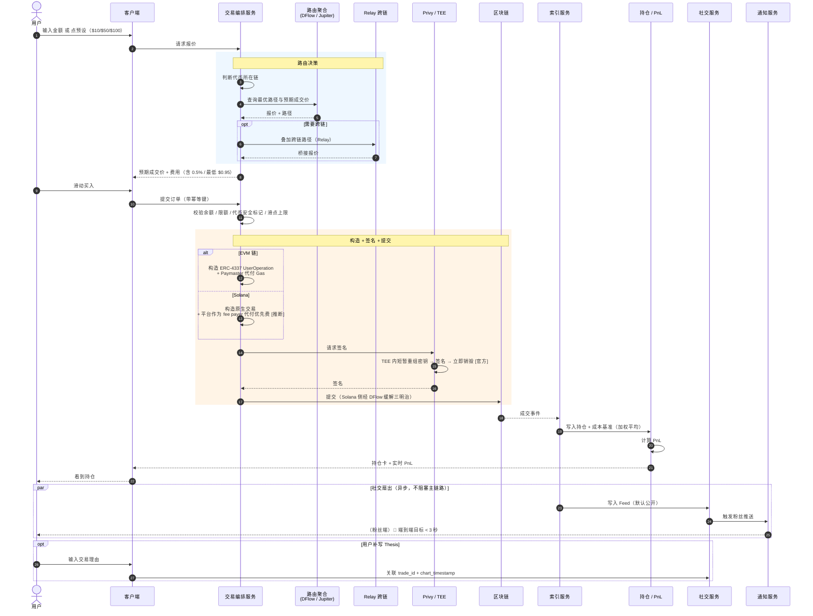

### 隐藏在「滑一下」背后的复杂度

一次点击串起了：报价聚合 → 跨链桥接 → 智能账户打包 → 分布式签名 → Gas 代付 → 链上提交 → 事件索引 → 持仓归集 → PnL 计算 → Feed 写入 → 推送扇出。

**这 11 步里任何一步慢，用户都会感知为「卖不出去」** —— 这正是 fomo 被反复投诉的点。

### 刻意的能力缺失

| 缺什么 | 后果 |
|---|---|
| 无限价单 / 止损（现货） | App Store 评论第一大需求 |
| 路由 / 滑点控制粒度低 | 认知负担降低，但责任转移给平台默认值 |
| 无执行质量披露 | 用户无法评估自己是否吃了亏 |
| 无狙击 / 捆绑钱包检测 | 专业用户仍需并行开终端 |

---

## ⑤ 持仓追踪

| # | 用户动作 | 系统动作 |
|---|---|---|
| 1 | 打开组合页 / 代币页 | 拉取全部持仓（跨链归集为美元） |
| 2 | — | **实时价格推送** → 重算未实现 PnL **[推断：WebSocket]** |
| 3 | 看 K 线上的动态 PnL 线 | 把入场价、当前价、PnL 画在图上 **[官方 2025-10]** |
| 4 | — | 更新 Profile 上的权益曲线、平均持仓时长 |

⚠️ PnL 的精确口径（FIFO / 加权平均、是否含手续费、是否含滑点）**未公开**。App 评论里有 PnL 不准的抱怨 **[三方]**。自建时这是必须一开始就定死的规则 —— 改口径会导致历史数据全部失真，而**这是公开排行榜的排序依据，出错就是信任事故**。

---

## ⑥ 平仓

| # | 用户动作 | 系统动作 |
|---|---|---|
| 1 | 点持仓 → 卖出（全部 / 部分） | 报价 |
| 2 | 滑动确认 | 同 ④ 的 4–6 步，方向相反 |
| 3 | — | 结算为 USDC 回到统一余额 |
| 4 | — | 计算**已实现盈亏**，归档持仓 |
| 5 | — | **Feed 发布「已完全平仓」事件**，含已实现 PnL |
| 6 | — | 更新排行榜、权益曲线、平均持仓时长 |
| 7 | 可分享战绩卡 | 生成分享卡片 → 站外传播 |

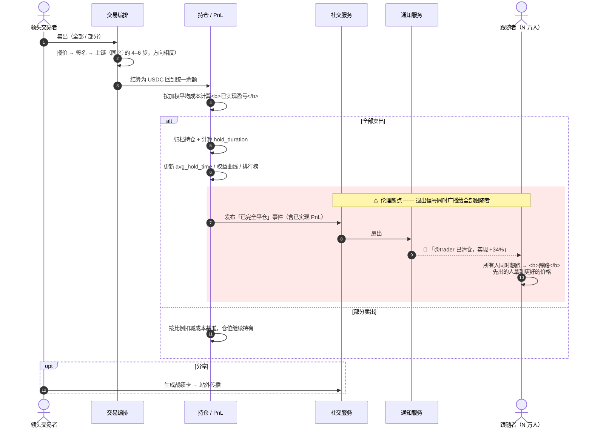

### 第 5 步是社交交易的伦理断点

「已平仓」事件会**同时**告知全部跟随者。带来两个效应：

1. ✅ 透明 —— 跟随者知道领头的人出了
2. ❌ **羊群踩踏** —— 所有人同时想跑，而先出的人拿到了更好的价格

Galaxy 的研究指出，实时可见的退出信号会显著放大立刻卖出的冲动，长期把整个用户群推向越来越短的持仓周期，最终有利于最快的剥头皮者、不利于其他所有人（内容经改写）。

**自建时的可选缓解手段**：平仓事件延迟广播（如 30–60 秒）、只广播「已平仓」不广播实时减仓过程、或对大额平仓做分批披露。这些都会削弱产品的「实时感」，是明确的产品价值观取舍。

---

## ⑦ 社交沉淀

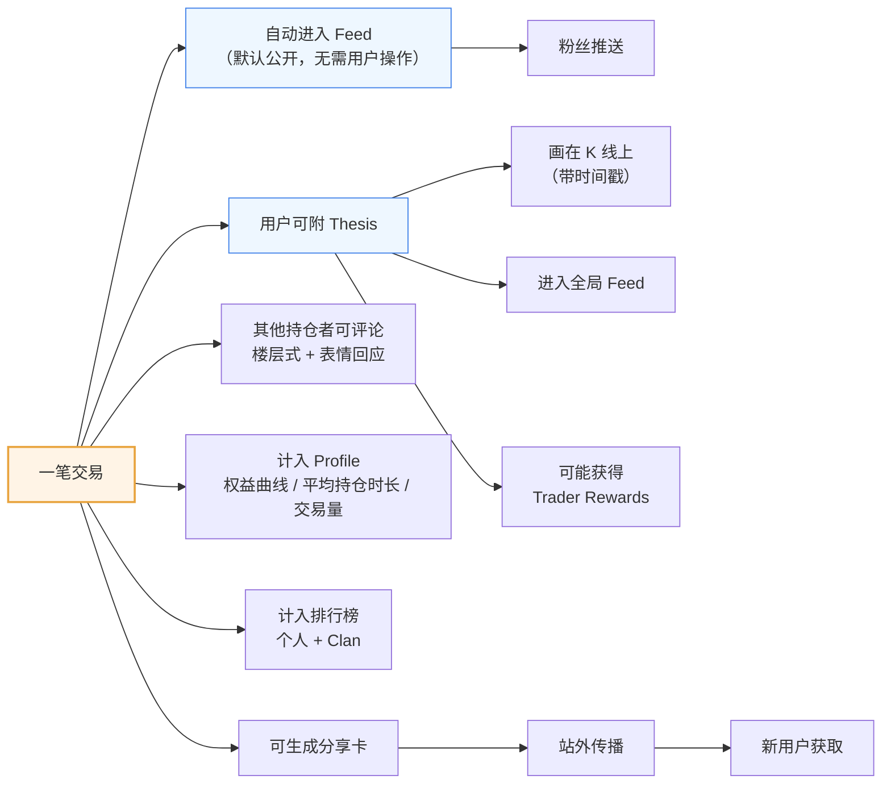

关键：**用户不需要主动「发帖」**。内容是交易的副产品。这解决了所有社交产品最难的问题 —— 冷启动的内容供给。

---

## ⑧ 出金

| # | 用户动作 | 系统动作 |
|---|---|---|
| 1 | 点提现 | 展示可用方式（链上地址 / 部分地区银行） |
| 2 | 填地址与金额、选网络 | 地址校验、风控筛查 |
| 3 | **FaceID 强制校验** | **[官方]** 出金必须过生物识别 |
| 4 | — | TEE 内签名 → 广播 |
| 5 | 完成 | 更新余额 |

设计哲学：**进来要快，出去要慢**。交易不要 FaceID，出金一定要。

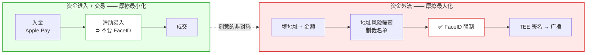

---

## ⑨ Perps 流程（美国用户不可用）

| # | 用户动作 | 系统动作 |
|---|---|---|
| 0 | — | **地域判定**，美国人直接隐藏入口 **[官方]** |
| 1 | 在 Feed / 排行榜发现某人的永续仓位 | 展示方向、杠杆、notional、equity |
| 2 | 进标的页 | 拉 Hyperliquid / Trade[XYZ] 行情与资金费率 |
| 3 | 设方向、杠杆、保证金 | 计算**逐仓**保证金与强平价 |
| 4 | 设 TP / SL（可选） | 下条件单到底层协议 |
| 5 | 一键开仓 | 划转保证金 → 在底层场馆下单 |
| 6 | — | 收 **0.05% builder fee**（每边），叠加协议费与资金费 |
| 7 | — | **仓位进入 Feed / 排行榜 / Profile** —— 与现货同一社交图谱 |

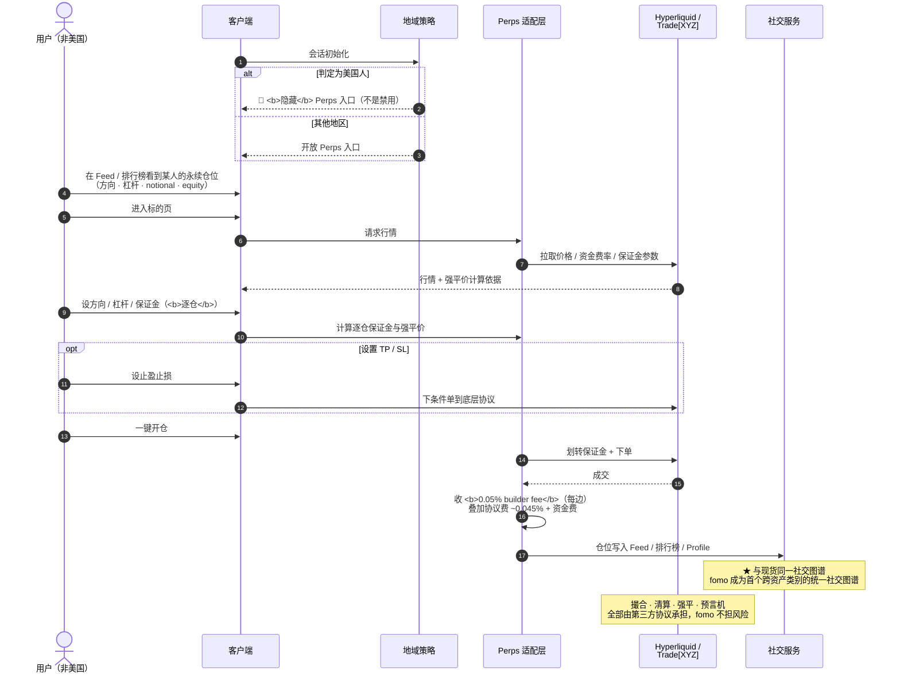

### 架构含义

Perps 是纯粹的 **builder / 接口层模式**：fomo 不做撮合、不做清算、不承担风险，只做 UI + 社交 + 抽 builder fee。

这是一个**极高杠杆的商业模型**（17 人团队），但也意味着：
- 资产覆盖受底层场馆限制
- 底层场馆宕机 = 你的产品宕机
- 底层场馆的合规限制直接传导（美国人被屏蔽）
- 费率上不占优势：0.05% + Hyperliquid 约 0.045% taker ≈ 全包 0.095%/边，约为直接在 Hyperliquid 交易成本的两倍 **[三方]**

---

## ⑩ Referral 流程

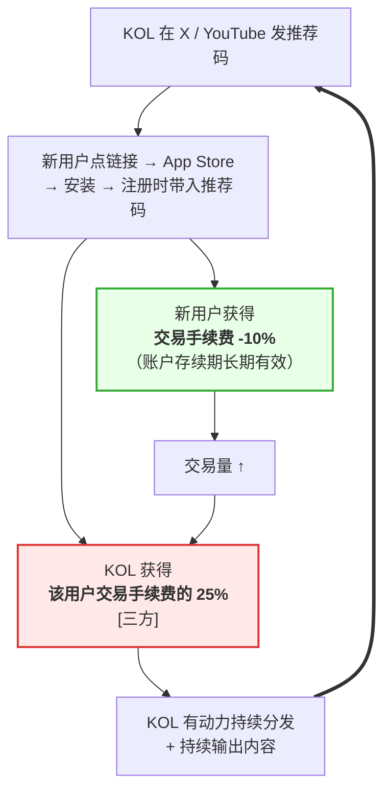

平台侧的净 take rate：

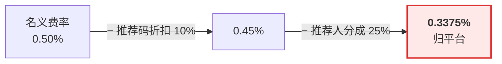

**25% 是激进的比例。** 这把 fomo 的分发外包给了 KOL 群体 —— 与它把执行外包给基础设施商是同一个思路：**只自己做社交图谱和数据，其他全部用经济激励或外采换来**。

累计返佣在 2026-06-02 已超 $2M **[三方]**。

---

## ⑪ Clan 流程

| # | 动作 | 说明 |
|---|---|---|
| 1 | 创建或被邀请加入 Clan | **一人同时只能在一个 Clan** |
| 2 | Clan 标签展示在 Profile | 身份标识 |
| 3 | Clan Feed 优先展示成员交易 | 降噪 |
| 4 | 成员各自用自己的余额交易 | **不共池、各自承担风险** |
| 5 | Clan 周榜排名 | 竞争机制 |
| 6 | 生成 Clan 战绩汇总卡 | 站外传播 |

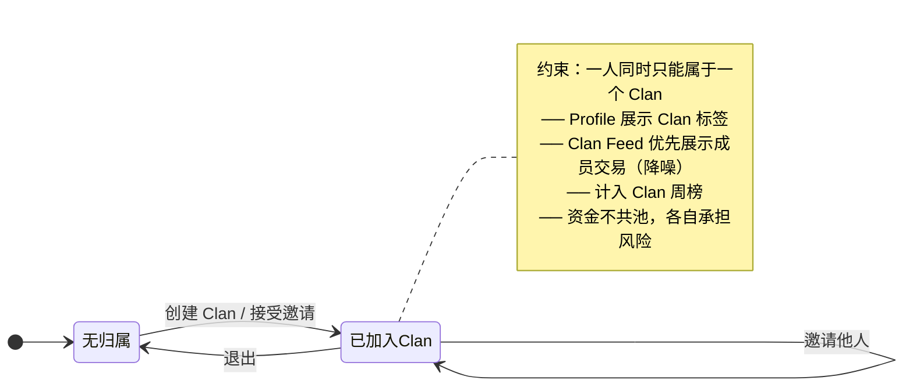

产品逻辑：从「跟随全平台」收窄到「跟随自选小圈子」。既降噪，也可能让风险集中（一群人一起追同一个新盘）。

---

## ⑫ 风控流程（贯穿全流程）

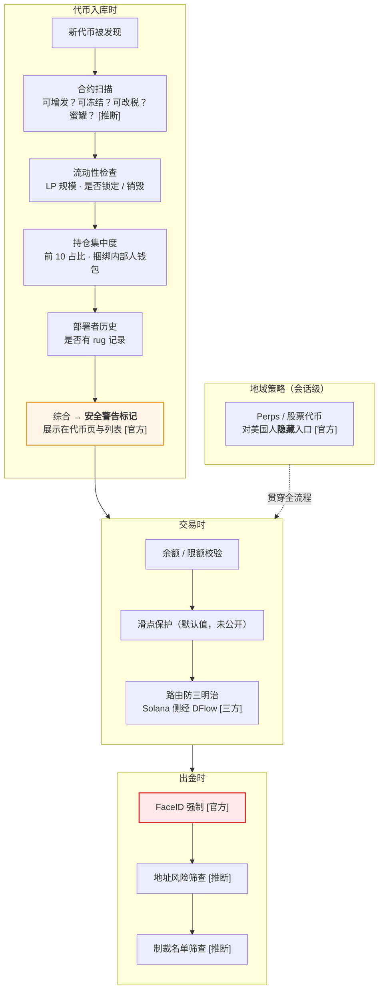

⚠️ 安全评分的**具体规则从未公开**。这既是商业机密，也可能是被攻击面 —— 规则公开就会被绕过。

---

## 流程设计的三条总结

1. **交易路径极短，资金外流路径极长。** 买入两次点击、不需要生物识别；出金必须 FaceID。这个非对称是刻意的。
2. **内容是交易的副产品，不是用户的额外负担。** 这是社交层能启动的唯一原因。
3. **所有复杂度都被藏起来了，但没有被消除。** 跨链、Gas、滑点、MEV、价格冲击仍然存在，只是用户看不见 —— 这既是产品价值，也是责任所在。判断标准不是「用户是否看到区块链」，而是**抽象之后，费用、执行质量、资产风险和亏损机制是否依然可理解**（[insights4.vc](https://insights4vc.substack.com/p/fomo-behind-the-75m-series-b-from)，内容经改写）。

---

> 本文档中对第三方内容的引用均已改写以符合授权限制（Content was rephrased for compliance with licensing restrictions）。
