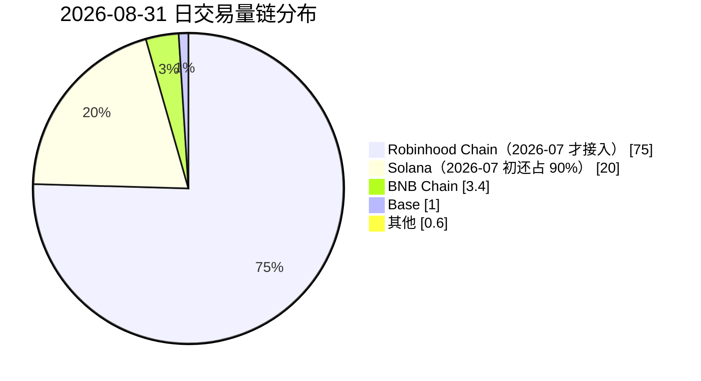
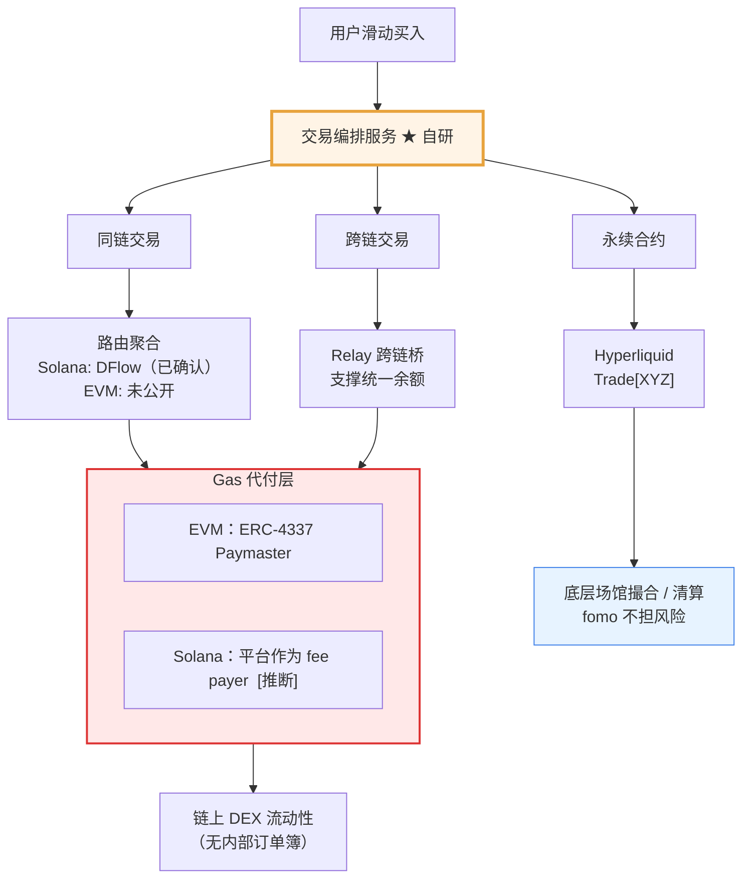
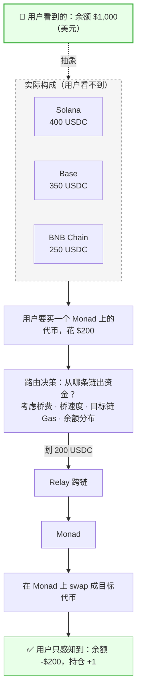
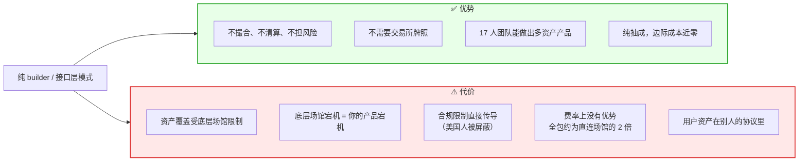
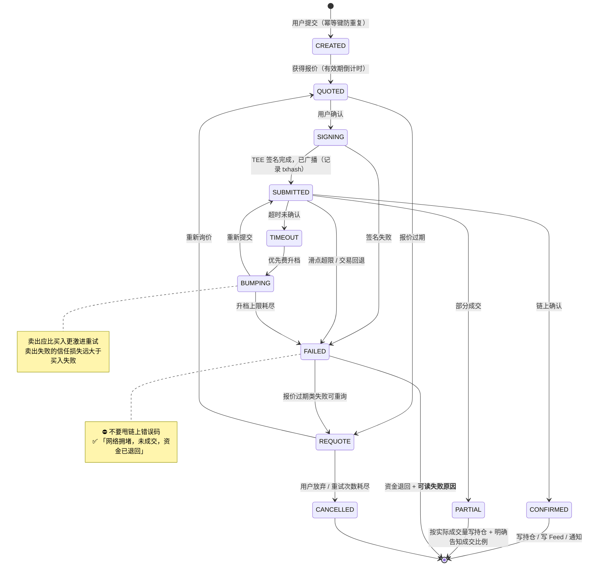

# 06 · 交易执行与跨链

---

## 1. 核心命题：一个余额，六条链，零 Gas

**[官方 + 三方]** fomo 维持单一 USD（USDC 计价）余额，把每笔交易发送到目标代币所在的网络。用户不跨桥，也不需要持有六种 Gas 代币。

支持网络（截至 2026-09）：

| 链 | 上线时间 | 备注 |
|---|---|---|
| **Solana** | 2025-05（首发） | Memecoin 主战场，亚秒确认，网络成本极低 |
| **Base** | 2025-09 | Coinbase L2 生态，DeFi 代币 |
| **BNB Chain** | 2025-10 | BNB 生态新币，第三个独立流动性池 |
| **Monad** | 2025-11（主网首发） | 高吞吐 EVM；fomo 是较早的消费级接入方 |
| **Ethereum** | 2026-05 提及 **[未验证]** | 官方产品页长期不列，功能完备度无文档说明 |
| **Robinhood Chain** | 2026-07 **[三方]** | 带来代币化美股（AAPL/TSLA/NVDA）；**美国用户屏蔽** |

### 选链逻辑：不追求覆盖数量，追求消费级交易活跃度

Datawallet 的观察很准（措辞已改写）：fomo 不以「支持最多链」为目标，而是聚焦**消费者交易活跃度强**的链。

这个逻辑被数据验证了 —— 2026-08-31 的链分布：



**[三方 Dune / Odaily]**

### 对架构的硬性要求

交易量高度跟随链上热点迁移 → **新链接入必须是低成本操作**。

理想状态是配置化接入：新增一条 EVM 链只需要填 chainId / RPC / 主流 DEX 合约地址 / 代币元数据源，而不是重写一套执行逻辑。这应该是自建时的核心架构指标之一。

---

## 2. 执行链路全图



---

## 3. 现货执行：路由与聚合

### 3.1 DFlow（Solana 侧，已确认）

**[三方 Datawallet]** fomo 使用 DFlow 做订单处理。DFlow 的定位（据 [iq.wiki](https://iq.wiki/zh/wiki/dflow)，措辞已改写）：

- Solana 原生的 DEX 聚合与路由基础设施
- 面向**低延迟最优执行**
- 汇总多个异构链上场馆的价格与流动性信息
- 内置机制用于**区分并缓解「有毒订单流」**，目标是保护 LP 收益

对 fomo 的价值：**防三明治攻击**。Datawallet 指出，DFlow 的订单处理能保护散户交易不被公开内存池里的抢跑机器人夹击（措辞已改写）。

⚠️ 变数：**DFlow 在 2026-05 被 MoonPay 以约 $100M 全股票收购** **[三方]**。被收购后的服务条款、定价、优先级都可能变化 —— 这是单点依赖的现实风险。

### 3.2 交易不经内部订单簿

**[三方]** 关键架构事实：fomo 的 swap 是**在链上对着去中心化流动性成交**，不走内部撮合。

这带来：
- ✅ 不需要做市、不需要托管、不需要交易所牌照
- ✅ 新币上线分钟级可交易（CEX 通常要等到最剧烈的行情过去）
- ❌ 价格冲击、滑点、报价过期、MEV、交易失败全部存在
- ❌ 薄流动性代币的卖出可能失败（这是 fomo 被投诉最多的点）

### 3.3 刻意收窄的控制面

**[官方]** fomo 自己在与 Phantom 的对比文章里承认：用户对路由和滑点的控制粒度低于直接使用 DEX 界面。

| 常规 DEX 给的控制 | fomo 是否暴露 |
|---|---|
| 滑点容忍度 | 隐藏（平台默认值） |
| 路由路径选择 | 隐藏 |
| 优先费/Gas 设置 | 隐藏（平台代付） |
| MEV 保护开关 | 隐藏（默认开） |
| 限价单 / 止损 | **现货不支持** |

**代价**：认知负担降低了，但责任转移给了平台的默认值。而公开文档**没有**披露审计过的执行质量统计，也没有完整的价格改善政策 **[三方 insights4.vc]**。

### 3.4 自建的执行质量清单

这是 fomo 做得不够、自建可以做差异化的地方：

| 项 | 建议做法 |
|---|---|
| **多聚合器比价** | 至少接两家（Solana: Jupiter + DFlow；EVM: 0x + 1inch + LiFi），取最优 |
| **滑点默认值分层** | 按代币流动性动态调整，而非全局固定值 |
| **失败重试策略** | 优先费动态升档；报价过期自动重询 |
| **执行质量披露** | 主动展示「实际成交价 vs 报价」偏差 —— 这是对 fomo 的直接差异化 |
| **部分成交处理** | 大单拆分，明确告知用户成交比例 |
| **卖出路径优化** | 卖出失败是最伤用户信任的事，卖出应比买入有更保守的滑点和更激进的重试 |

---

## 4. 跨链：Relay + 统一余额

### 4.1 机制

**[三方 Datawallet]** fomo 依赖 Relay 的桥接基础设施实现「一个余额覆盖多链」。用户选代币、确认交易，**桥接在后台发生，不需要单独的授权步骤或第二个钱包**。

从用户视角：



### 4.2 工程上的难点（自建必须处理）

| 问题 | 说明 |
|---|---|
| **余额归集** | 用户看到一个数字，实际是 N 条链余额之和。要处理链间不一致、待确认交易、**跨链在途资金** |
| **在途资金的可见性** | 跨链需要时间。这段时间钱「在路上」—— 余额怎么显示？能不能再下单？ |
| **路由决策** | 从哪条链出资金？考虑桥费、桥速度、目标链 Gas、余额分布 |
| **失败回滚** | 桥成功但 swap 失败怎么办？资金留在目标链？自动桥回？ |
| **预备流动性** | 更激进的做法是平台在各链预置流动性，用户交易走平台内部记账 + 事后再平衡 —— 体验最快，但平台承担资金成本和风险 |

⚠️ **第 5 项是关键的架构分叉点。** 纯桥接路线慢但干净；预置流动性路线快但让平台变成了资金池运营方（合规含义完全不同）。fomo 走的是哪条路线未公开，从「无需单独授权步骤」的描述看**可能包含预置流动性成分** **[推断]**。

### 4.3 桥的安全性

**跨链桥是历史上被盗金额最大的一类基础设施。** 自建绝对不要造桥。

建议：
- 用成熟服务（Relay / LiFi / Across / deBridge）
- **接两家以上**，单桥故障时降级为「仅支持该链内交易」而非整体不可用
- 对单笔跨链金额设上限
- 监控桥的 TVL 与异常提取

---

## 5. Gas 代付

### 5.1 EVM：ERC-4337 Paymaster

**[官方]** Paymaster 合约替用户付 Gas。用户在 Base 上不需要 ETH，在 BNB Chain 上不需要 BNB。

经济可行性靠两件事：
1. **交易批处理** —— 多操作打包，摊薄固定开销
2. **$0.95 最低费** —— 保证小额交易不亏（详见 [08](08-费用结构与商业模式.md)）

### 5.2 Solana：平台作为 fee payer **[推断]**

Solana 没有 ERC-4337。Gas（含优先费）极低，实现上通常是平台签名作为 fee payer，或经 relayer 提交。

⚠️ Solana 的真实成本风险不在 base fee，而在**优先费（priority fee）**。拥塞时段优先费可以涨几个数量级，而热门 Memecoin 交易恰好都在拥塞时段。**这是 Gas 代付模型最大的成本敞口。**

### 5.3 成本转移而非消除

insights4.vc 的定性很准（措辞已改写）：Gas 代付是**转移**成本而不是消除成本 —— 平台吸收或打包了网络费与优先费，提升了转化，但也让自己暴露在费用飙升、滥用行为，以及小额交易极薄的单位经济之下。

### 5.4 自建的 Gas 代付风控

| 风险 | 缓解 |
|---|---|
| 优先费飙升 | 设单笔 Gas 上限；超限时降级为「提示用户网络拥堵，稍后重试」或让用户自付 |
| 刷量套利 | 单用户频率限制；最低交易金额；异常模式检测 |
| 小额交易亏损 | 最低费机制（fomo 的 $0.95）；或对小额单不代付 Gas |
| 新用户滥用 | 未入金账户不给代付额度 |

建议做一个**实时 Gas 成本看板**，按链、按时段、按用户分层监控代付支出。这是这类产品最容易失控的一项成本。

---

## 6. 永续合约执行：纯 builder 模式

**[官方]** fomo Perps 由 **Hyperliquid** 和 **Trade[XYZ]** 提供执行，fomo 只做接口与社交层。

### 6.1 职责划分

| 环节 | 谁做 |
|---|---|
| 撮合 | Hyperliquid / Trade[XYZ] |
| 清算与强平 | 同上 |
| 预言机价格 | 同上 |
| 资金费率 | 同上 |
| 风险承担 | 底层协议 + 用户 |
| **UI / UX** | **fomo** |
| **社交层（Feed/排行榜/Thesis）** | **fomo** |
| **builder fee 抽成 0.05%/边** | **fomo** |

### 6.2 首版产品特性

**[官方]**
- **逐仓保证金（isolated margin）** —— 为了和现货体验统一
- 一键交易
- **止盈 / 止损（TP/SL）**，并首次把高级图表带到移动端
- 现货与永续统一的组合视图
- 复用现有 fomo 账户
- 展示：方向（多/空）、杠杆、仓位规模（notional）、仓位价值（equity）

### 6.3 资产覆盖

| 类别 | 标的 |
|---|---|
| Pre-IPO | SpaceX |
| 美股 | NVDA、GOOGL、AMD、MU、SNDK |
| 加密 | BTC、ETH、SOL、HYPE |
| 指数 | S&P 500、Nasdaq 100、Kospi 200、Nikkei 225 |
| 商品 | 原油、白银、黄金、铜、天然气 |

**这个覆盖范围对消费级产品来说极不寻常。** 它让 fomo 成为「第一个跨资产类别的统一社交图谱」—— 同一个 Feed 里既有 Memecoin 也有 SpaceX 永续。

### 6.4 成本劣势

**[三方 Datawallet]**

```text
fomo builder fee        0.05% / 边
Hyperliquid taker fee  ~0.045%
─────────────────────────────────
全包                   ~0.095% / 边
```

约为直接在 Hyperliquid 交易的**两倍**。Phantom 的 builder fee 同样是 0.05%，所以与 Phantom 相比成本中性。

**结论**：Perps 的价值主张不是便宜，是**接口 + 社交 + 一个账户通吃**。

### 6.5 🚫 硬性限制

**[官方，明确声明]** Perps 由第三方协议提供，**不向美国人开放** —— 包括公民、居民、以及任何身处美国境内的人。官方措辞是「不要试图从美国境内访问 perps」。

这是外采架构的合规传导：**底层场馆的限制直接变成你的限制**。

### 6.6 架构含义（重要）



**对自建的建议**：Perps 不要放在第一年。它的工程量不大（就是接 API），但它带来的合规复杂度、地域屏蔽逻辑、用户教育成本和风险披露责任都是量级跃升。先把现货社交交易做扎实。

---

## 7. 交易状态机（自建必做）

fomo 被投诉最多的是「卖不出去」「订单延迟」「PnL 不准」。根源都在交易状态管理。



必须做到的几点：

1. **状态持久化** —— 不能只在内存里，服务重启不能丢单
2. **幂等** —— 用户连点三次只能下一单
3. **失败原因人类可读** —— 不要甩链上错误码，要说「网络拥堵，未成交，资金已退回」
4. **超时策略** —— Solana 上交易可能长时间不确认，必须有明确的超时和重试逻辑
5. **卖出比买入更保守** —— 卖出失败的用户信任损失远大于买入失败

---

## 8. 自建技术选型（执行层）

| 环节 | 推荐方案 | 备选 |
|---|---|---|
| **Solana 路由** | Jupiter（覆盖最广、文档最好） | DFlow、Titan |
| **EVM 路由** | 0x Swap API 或 LiFi | 1inch、Odos、Enso |
| **跨链** | Relay 或 LiFi（同时解决路由+跨链） | Across、deBridge、Socket |
| **ERC-4337 Bundler** | Pimlico | Alchemy、Biconomy、ZeroDev |
| **Paymaster** | Pimlico / ZeroDev，或自建（控成本） | — |
| **Solana RPC** | Helius 或 Triton（需要低延迟专用节点） | QuickNode |
| **EVM RPC** | Alchemy / QuickNode | 自建节点（量大后） |
| **Perps（如要做）** | Hyperliquid builder codes | Paradex、Vertex |

### 关键建议

1. **路由层做成抽象接口，不要绑死一家。** 这是最容易被供应商变动影响的环节（DFlow 被 MoonPay 收购就是活例子）。
2. **RPC 要用专用节点，不要用公共 RPC。** 社交交易的实时性承诺（端到端 <3 秒）撑不住公共 RPC 的延迟。
3. **优先把「新链接入成本」压到最低。** 交易量跟着热点跑，接入慢一个月就错过一个周期。

---

> 本文档中对第三方内容的引用均已改写以符合授权限制（Content was rephrased for compliance with licensing restrictions）。
