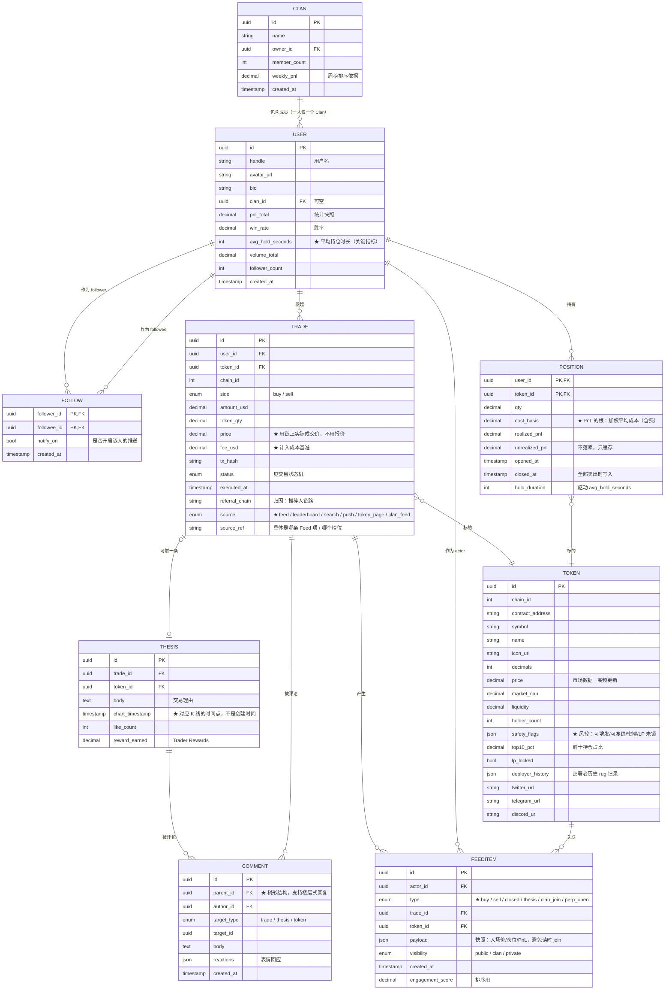
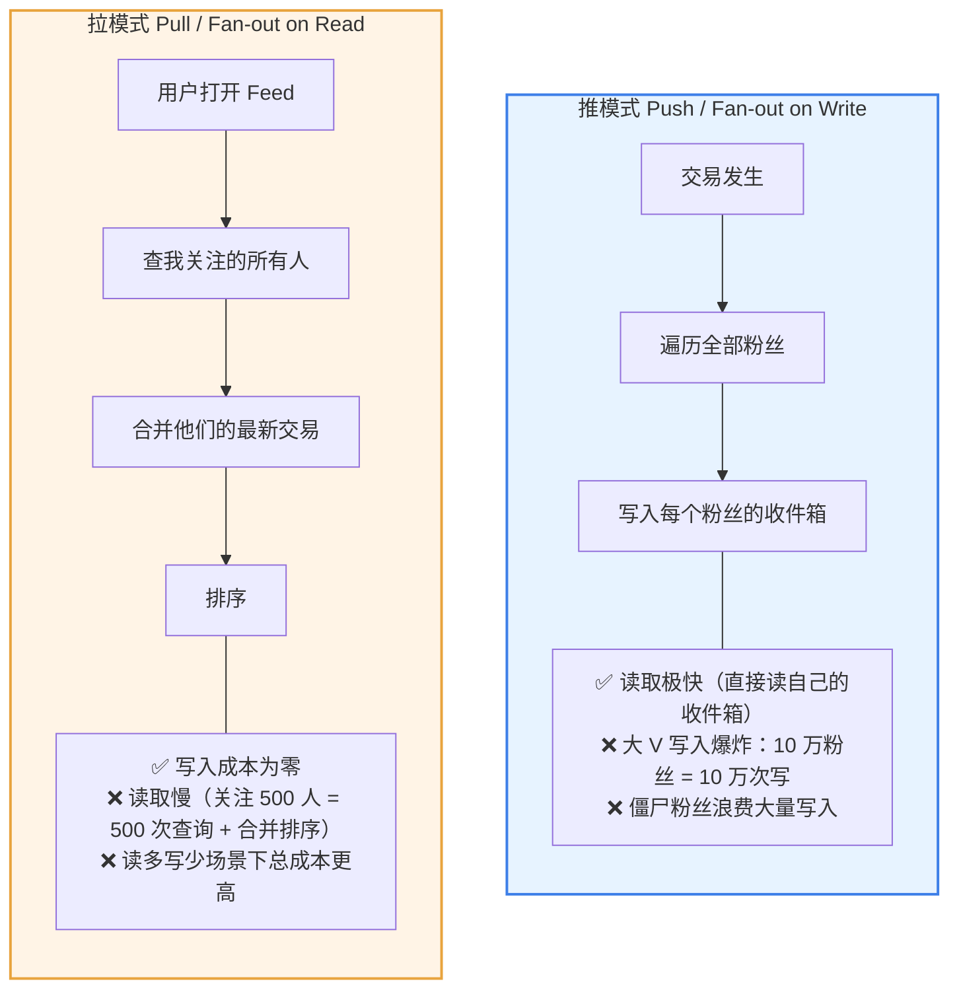
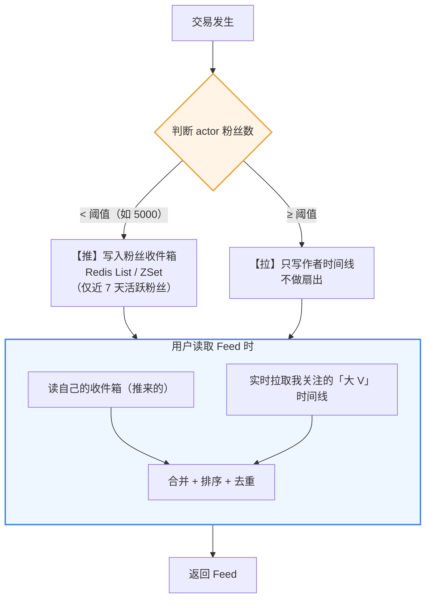
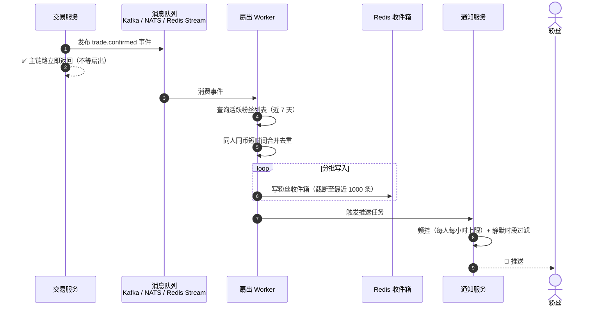
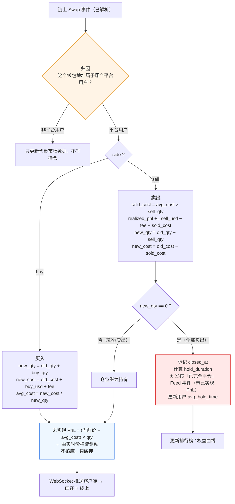
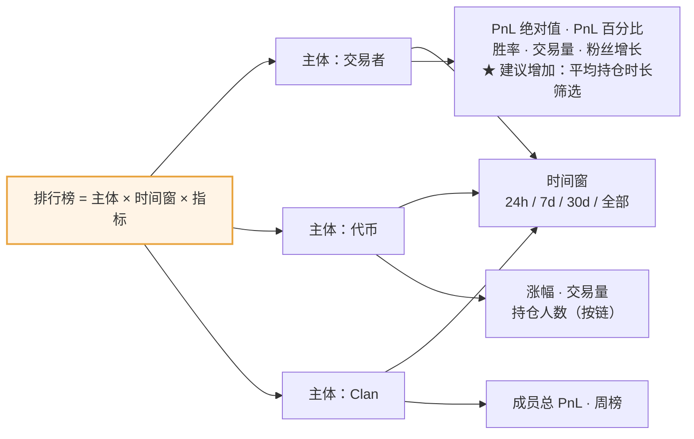
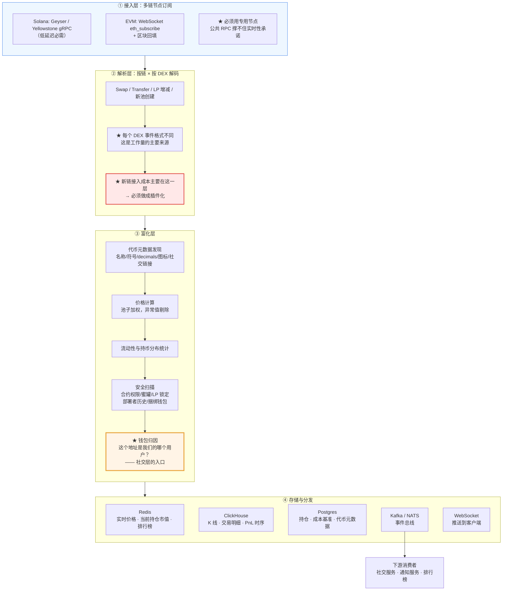
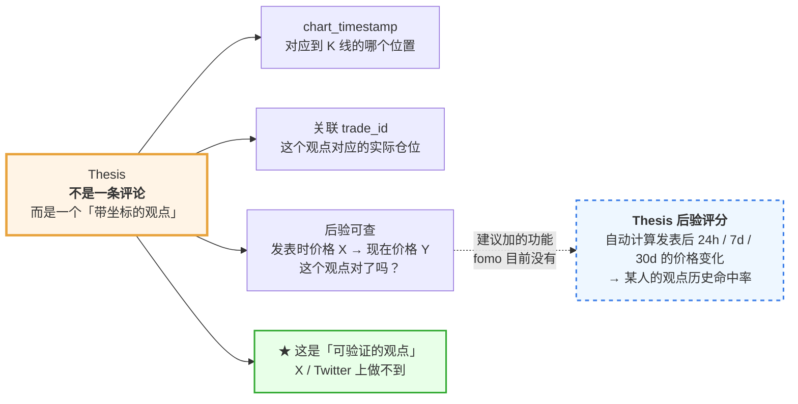
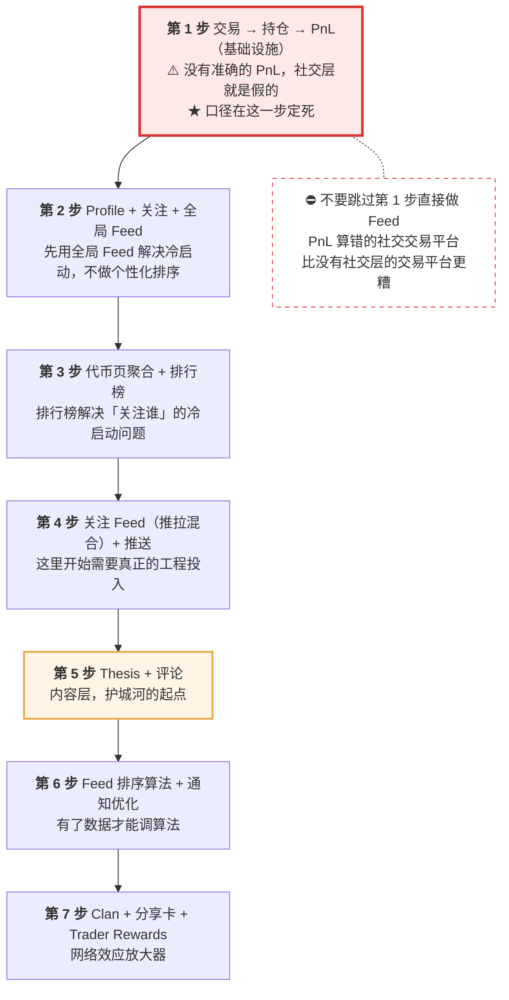

# 07 · 社交图谱与数据体系

> 这是自建时**唯一必须自研、也最该投入的部分**。执行层能买，社交图谱买不到。
>
> fomo 从未公开过这部分的实现，本文档除标注外均为 **[推断]** —— 基于其可见的产品行为（Feed 有哪些字段、排行榜有哪些维度）反推出的数据模型与工程方案。

---

## 1. 为什么这是护城河

insights4.vc 的判断（措辞已改写）：由于执行基础设施主要来自外部合作方，fomo 的潜在防御力位于**执行层之上** —— 在身份、交易、粉丝、通知、书面 thesis、发现历史与声誉之间的连接关系里。

但同一份研究也提醒：**这个护城河尚未被证明**。fomo 没有公开过 cohort 留存、粉丝集中度、发现到交易的转化率，也没有公开用户在不活跃交易时是否还会打开 App。fomo CEO 自己承认产品目前仍是交易属性远重于社交属性。

**对自建的启示**：社交层不是加个 Feed 就完事。要从第一天起就埋好衡量它是否真的产生了网络效应的指标（见本文档第 9 节）。

---

## 2. 数据模型

### 2.1 实体关系图



### 2.2 几个关键字段的设计说明

| 字段 | 为什么关键 |
|---|---|
| `Thesis.chart_timestamp` | Thesis 要**画在 K 线上**（官方特性）。必须记录对应的图表时间点，而非仅记录创建时间 |
| `Position.cost_basis` | PnL 的根。口径必须一开始定死（见第 4 节） |
| `FeedItem.type` | 至少要区分：买入 / 卖出 / **完全平仓**（带已实现 PnL）/ 发布 Thesis / 加入 Clan / 开永续仓 |
| `Trade.source` | 归因用：这笔交易是从 Feed 点来的、从排行榜来的，还是搜索来的？**这是衡量社交层价值的唯一方式** |
| `Token.safety_flags` | 风控标记，展示在代币页和列表 |
| `Comment.parent_id` | 楼层式回复（2025-12 上线）需要树形结构 |

### 2.3 存储分层建议

| 数据类型 | 存储 | 理由 |
|---|---|---|
| User / Follow / Clan / Trade / Position | **Postgres** | 强一致、有事务需求、关系查询 |
| Thesis / Comment | **Postgres**（+ 全文索引） | 同上 |
| 价格 / K 线 / PnL 时间序列 | **ClickHouse** 或 TimescaleDB | 写入量巨大、按时间范围聚合查询 |
| 实时价格 / 当前持仓市值 / 排行榜缓存 | **Redis** | 毫秒级读、高频更新 |
| Feed 收件箱 | **Redis**（热）+ Postgres/Cassandra（冷） | 见第 3 节 |
| 关注图谱（如规模极大） | Postgres 足够；超大规模考虑图数据库 | 大多数场景 Postgres + 合理索引就够 |

⚠️ **不要一开始上图数据库。** 关注关系在千万级以下用 Postgres 加索引完全够用，引入 Neo4j 一类的成本远大于收益。

---

## 3. Feed 系统（最难的工程部分）

### 3.1 四种 Feed

| Feed | 数据源 | 实现难度 |
|---|---|---|
| **全局 Feed** | 全平台交易按热度/时间排序 | 低（单一列表 + 缓存） |
| **关注 Feed** | 我关注的人的交易 | **高**（扇出问题） |
| **Clan Feed** | 我的 Clan 成员的交易 | 中（成员数有上限） |
| **代币 Feed** | 单个代币下的交易与 Thesis | 低（按 token_id 索引） |

### 3.2 扇出问题：推 vs 拉

这是 Feed 系统的核心矛盾。头部交易者有六位数粉丝。



### 3.3 推荐方案：混合模式



扇出的异步化（**不能阻塞交易主链路**）：



补充优化：

| 优化 | 说明 |
|---|---|
| **活跃粉丝优先** | 只给近 7 天活跃的粉丝做推扇出，僵尸用户走拉模式 |
| **交易聚合** | 同一人短时间内连续买同一代币 → 合并为一条 Feed 项，不刷屏 |
| **写入异步化** | 扇出走消息队列（Kafka / NATS / Redis Stream），不阻塞交易主链路 |
| **收件箱截断** | Redis 里只保留最近 N 条（如 1000），更早的走冷存储 |

### 3.4 排序算法

fomo 的排序逻辑未公开。合理的起点是组合评分：

```text
score = w1 · 时效性衰减(now - created_at)
      + w2 · 亲密度(viewer, actor)        ← 互关 / 历史互动频率
      + w3 · 作者可信度                    ← 排行榜位次 / PnL / 平均持仓时长
      + w4 · 内容质量                      ← 有无 Thesis / 评论数 / 点赞数
      + w5 · 仓位显著性                    ← 金额大小 / PnL 幅度
      + w6 · 代币热度
      － p1 · 安全风险惩罚                  ← 被标记的代币降权
      － p2 · 同代币重复惩罚                ← 避免 Feed 全是同一个币
```

**关键取舍**：`w5`（仓位显著性）和 `w6`（代币热度）权重越高，Feed 越容易制造羊群效应。`w3`（作者可信度）和 `w4`（内容质量）权重越高，Feed 越偏向有信息量的内容。

**这是产品价值观在算法里的直接体现。** 建议至少把「平均持仓时长」纳入作者可信度 —— 这会自然降低剥头皮者的曝光。

### 3.5 通知扇出

Feed 之外还有推送。这是转化率最高、也最容易毁掉用户体验的通道。

必做的三件事：

1. **去重与聚合** —— 同一人连买 5 笔不能推 5 条，合并为「@trader 在 $TOKEN 上加仓」
2. **用户级频控** —— 每人每小时推送上限。超了就不推，否则用户直接关通知（**一旦关掉基本不会再开**）
3. **分级订阅** —— 用户应能选择「只推我特别关注的人」而不是「所有关注的人」

端到端延迟目标：**<3 秒**（从链上确认到手机震动）。超过这个数，跟随者拿到的价格已明显劣于领头者。

---

## 4. PnL 计算（最容易出信任事故的地方）

### 4.1 为什么这是高危模块

PnL 不只是个显示数字，它是：
- **公开排行榜的排序依据**
- 用户判断要不要跟随某人的依据
- 站外传播的分享卡内容

**算错 = 信任事故。** fomo 的 App 评论里有 PnL 不准的抱怨 **[三方]**。

### 4.2 必须一开始定死的口径

| 决策项 | 选项 | 建议 |
|---|---|---|
| **成本基准法** | FIFO / LIFO / 加权平均 | **加权平均**（对高频交易者最符合直觉，实现也最简单） |
| **是否含手续费** | 含 / 不含 | **含**（否则用户会发现「显示赚钱实际亏钱」） |
| **是否含滑点** | 用报价 / 用实际成交 | **用实际成交价**（从链上事件解析，不用报价） |
| **跨链持仓合并** | 同一代币在多链算一个仓 / 分开算 | 分开算（不同链是不同资产） |
| **空投/转入代币的成本** | 算 0 / 算转入时市价 | 明确标注为「非交易获得」，单独归类 |
| **部分卖出** | 如何分摊成本 | 按加权平均成本按比例扣减 |

⚠️ **口径一旦上线就不能改。** 改口径会让所有历史 PnL 和排行榜失真 —— 而这是公开数据，用户会立刻发现。

### 4.3 计算流程



### 4.4 「平均持仓时长」的战略价值

**[官方特性]** fomo 把平均持仓时长做成了可见指标。Galaxy 的评价（措辞已改写）：这看似是个小功能，但它帮助用户区分**时间尺度与自己匹配的交易者**和**很可能快速剥头皮离场的人** —— 在钱包追踪时代，你能看到一个地址的活动，却没有可靠方式评估地址背后的人。

**建议在自建产品中把它放到更显眼的位置**，甚至作为排行榜的一个筛选维度（如「持仓 >24h 的交易者榜」）。这是对冲短期化倾向的产品手段之一。

---

## 5. 排行榜

### 5.1 维度矩阵



### 5.2 实现方案

```text
实时增量更新（Redis ZSET）
  每笔交易结算后 → ZINCRBY leaderboard:trader:pnl:24h {user_id} {delta}
  读取 → ZREVRANGE 取 Top N
  ✅ 读写都是 O(log N)
  ❌ 时间窗滚动需要额外处理

时间窗滚动方案：
  方案 A（简单）：按小时分桶，读取时合并最近 24 个桶
  方案 B（精确）：定时任务从 ClickHouse 重算，写回 Redis
  建议：Redis 增量做实时近似 + 每 5 分钟从 ClickHouse 校准
```

### 5.3 反作弊（必做）

公开排行榜必然被刷。至少要防：

| 手法 | 检测 |
|---|---|
| **自成交刷量** | 同一实体的多账户互相对冲；识别关联账户（设备、IP、资金来源） |
| **小盘币自拉** | 自己控盘的代币上做出高 PnL；检查代币流动性与持仓集中度 |
| **多账户择优展示** | 一个人开 N 个账户，只推广赢的那个。这**无法完全解决**，但可以在产品上提示「单账户记录不代表完整仓位」 |
| **刷单骗 Trader Rewards** | 奖励发放前做人工/规则审核 |

⚠️ Galaxy 指出了一个**结构性的、无法靠技术解决的**问题（措辞已改写）：交易者可以在另一个钱包建仓，然后在平台账户上买入以向粉丝发出信号，接着从隐藏钱包向粉丝刚创造的流动性出货，最后才在平台上卖出。**这种多钱包操纵容易执行、且跟随者难以察觉。**

唯一诚实的应对是**在产品里明确披露这个局限**，不要让用户以为公开记录等于完整财务真相。

---

## 6. 链上数据索引管道

### 6.1 为什么 fomo 最终要自研

**[三方 Odaily]** 问题描述（措辞已改写）：新代币出现时，应用需要识别它的合约地址、名称和所属网络，同时持续读取交易、流动性、价格、持币地址与钱包行为，再把来自不同链的原始记录整理成用户能理解的数据。

2026-08-31 fomo 收购 Mobula 的软件与 IP（Axios 引 CEO 称约 $17M），Mobula 创始人 Sacha Marcus、CTO Sacha Delhoux、基础设施负责人 Cyril Conan 加入团队。fomo 的说法是这些资产能让它**对链上数据与全球基础设施有更强的掌控，减少对外部基础设施商的依赖**，并将聚焦**数据可靠性与平台性能**。

触发条件很清楚：**日活从几千涨到十万以上 + 同时覆盖 Solana / Robinhood Chain / BNB 等多网络**。

### 6.2 管道架构



### 6.3 延迟预算

社交交易的承诺是「他买的那一刻你就知道」。分解到每一段：

| 环节 | 目标延迟 |
|---|---|
| 链上确认 → 节点推送 | <500ms |
| 事件解析 + 归因 | <300ms |
| 持仓更新 + PnL 计算 | <200ms |
| Feed 写入 + 扇出触发 | <500ms |
| 推送网关 → APNs/FCM | <1s |
| **端到端** | **<3s** |

### 6.4 自建的阶段性策略

| 阶段 | 方案 | 理由 |
|---|---|---|
| **第一年** | 全部外采：Birdeye / Helius（Solana）+ Codex / Moralis / Mobula（多链） | 自建索引是 5–8 人的长期投入，早期不该碰 |
| **中期** | 双写：三方 + 自建并行，互相校验 | 验证自建数据质量，同时保留兜底 |
| **规模期** | 自建为主，三方兜底 | 延迟、成本、新链速度、数据独占 |

**判断切换时机的指标**：三方 API 月账单超过自建团队成本，或延迟无法满足 <3s 端到端目标，或新链支持速度成为业务瓶颈。

---

## 7. Thesis：唯一无法从链上抓取的数据

这是最被低估的模块。

链上数据人人可抓 —— 交易、持仓、PnL 都是公开的。**Thesis 不是。** 它是用户主动生产的、平台独占的内容资产。

### 7.1 它的三重作用

1. **把交易从数据变成观点** —— 可被讨论、引用、验证
2. **是 Trader Rewards 的载体** —— 内容促成他人交易即可获奖励
3. **是真正的护城河** —— 即使竞品抄走全部功能，也抄不走这些内容和围绕它形成的讨论

### 7.2 关键实现细节

**[官方]** Thesis 带时间戳画在 K 线上；Web 版代币页展示 Thesis 的撰写时间、作者和受欢迎程度。

这意味着：



**建议加的功能（fomo 目前没有）**：Thesis 的**后验评分** —— 自动计算「发表后 24h/7d/30d 的价格变化」，让用户能看到某人的观点历史命中率。这会是对 fomo 的直接差异化。

---

## 8. 社交层的结构性风险（必须在设计阶段就处理）

Galaxy 的研究列出了社交交易的固有风险，这里翻译成工程与产品对策：

| 风险 | 机制 | 可选对策 | 代价 |
|---|---|---|---|
| **羊群效应** | 可见 + 一键执行 = 反馈回路被压缩到秒级 | Feed 排序降低「仓位显著性」权重；对被大量跟随的代币加风险提示 | 削弱转化率 |
| **出货流动性** | 头部交易者的 PnL 部分来自粉丝涌入，而非能力 | 展示「该交易者的跟随者平均收益」← **这个指标很狠但很诚实** | 头部用户会反对 |
| **多钱包操纵** | 平台账户建仓发信号，隐藏钱包出货 | 无法技术解决；**必须在产品中披露局限** | 无 |
| **时间尺度压缩** | 实时看到别人退出 → 立刻想跑 | 平仓事件延迟广播（30–60s）；突出平均持仓时长 | 削弱「实时感」 |
| **游戏化成瘾** | 排行榜 + PnL 分享卡 + 实时 Feed 借用了成瘾设计的手法 | 推送频控；亏损同样公开；冷静期提示 | 削弱活跃度 |

### 关于「出货流动性」指标的建议

Galaxy 指出，一个交易者越有名、这个不对称越严重 —— **他的 PnL 部分是粉丝数量的函数，而不只是能力的函数**（措辞已改写）。

真正诚实的产品会计算并展示：**「跟随这个人交易的用户，平均收益是多少」**。这个数字大概率是负的，而这正是用户需要知道的。

这是一个明确的产品价值观选择：要不要做一个损害头部用户利益、但保护普通用户的功能。fomo 没做。

---

## 9. 必须埋的指标（验证社交层是否真的有效）

insights4.vc 指出 fomo 从未公开这些数据，导致其双边网络只是「战略上说得通」而非「数据上被证明」。**自建产品要从第一天就测量**：

### 社交层价值验证

| 指标 | 为什么关键 |
|---|---|
| **发现→交易转化率**（按来源：Feed / 排行榜 / 搜索 / 推送） | 如果 Feed 的转化率不显著高于搜索，社交层就是装饰 |
| **非交易日活占比** | 用户在不交易的日子会不会打开 App？**这是「社交」成立的唯一硬证据** |
| **人均关注数分布** | 关注 0 人的用户占比过高 = 社交层没跑通 |
| **粉丝集中度（基尼系数）** | 过度集中 = 高出货流动性风险 |
| **Thesis 生产率** | 多少比例的交易带 Thesis？这是内容供给的健康度 |
| **评论/互动率** | 是不是只有单向消费，没有双向互动 |

### 业务健康度

| 指标 | 说明 |
|---|---|
| Cohort 留存（D1/D7/D30） | 按获取渠道分层（KOL 推荐码 vs 自然） |
| 交易者 / 注册用户比 | fomo 唯一披露过的是 2025-11 的约 29% |
| **跟随者平均收益** | 最重要也最不想看的数字 |
| 平均持仓时长趋势 | 如果持续下降，说明产品在把用户推向短期化 |
| 小额交易占比 | 关联到 $0.95 最低费的用户体验问题 |

**建议**：把「跟随者平均收益」和「非交易日活占比」列为北极星指标的一部分。前者衡量产品是否在真正帮用户，后者衡量社交层是否真的存在。

---

## 10. 自建实施顺序



⚠️ **不要跳过第 1 步直接做 Feed。** 一个 PnL 算错的社交交易平台比没有社交层的交易平台更糟 —— 它在用错误数据引导用户的资金决策。

---

> 本文档中对第三方内容的引用均已改写以符合授权限制（Content was rephrased for compliance with licensing restrictions）。
