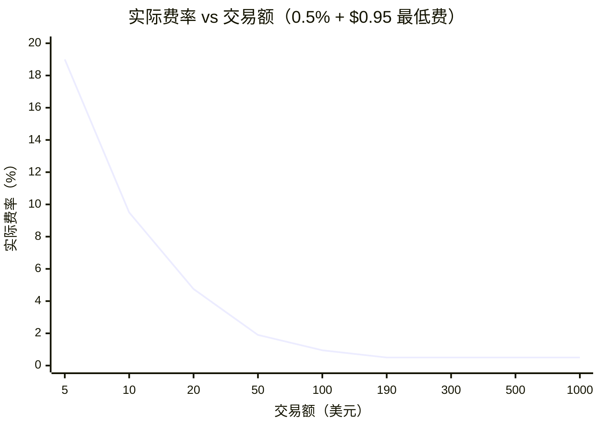
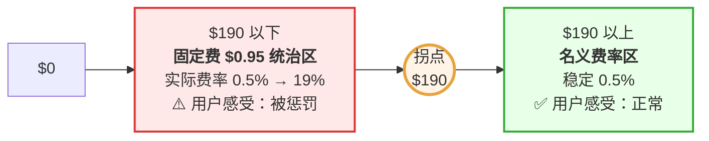
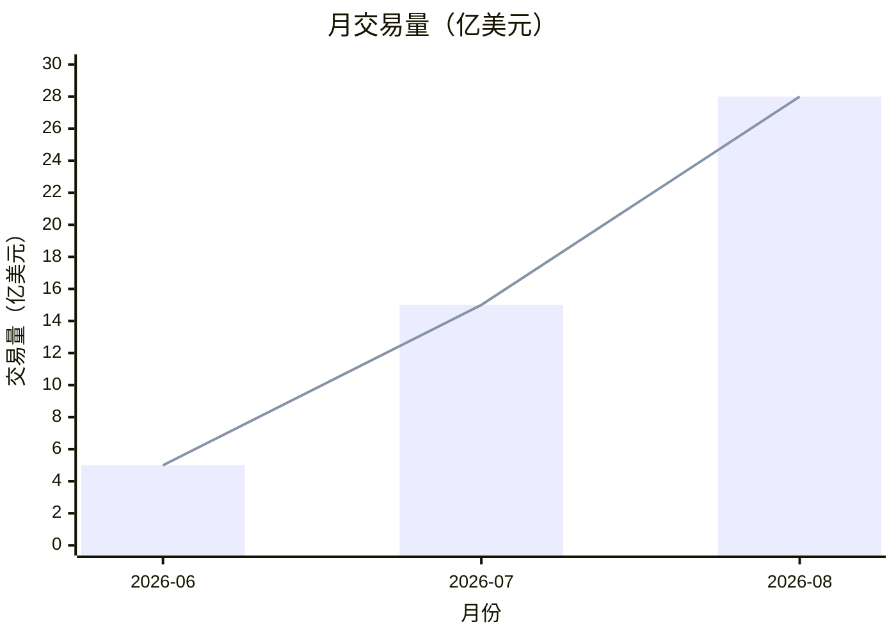
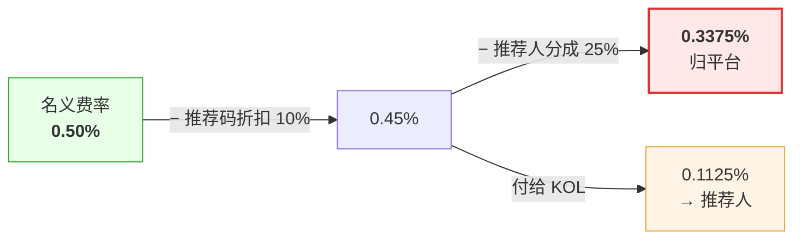
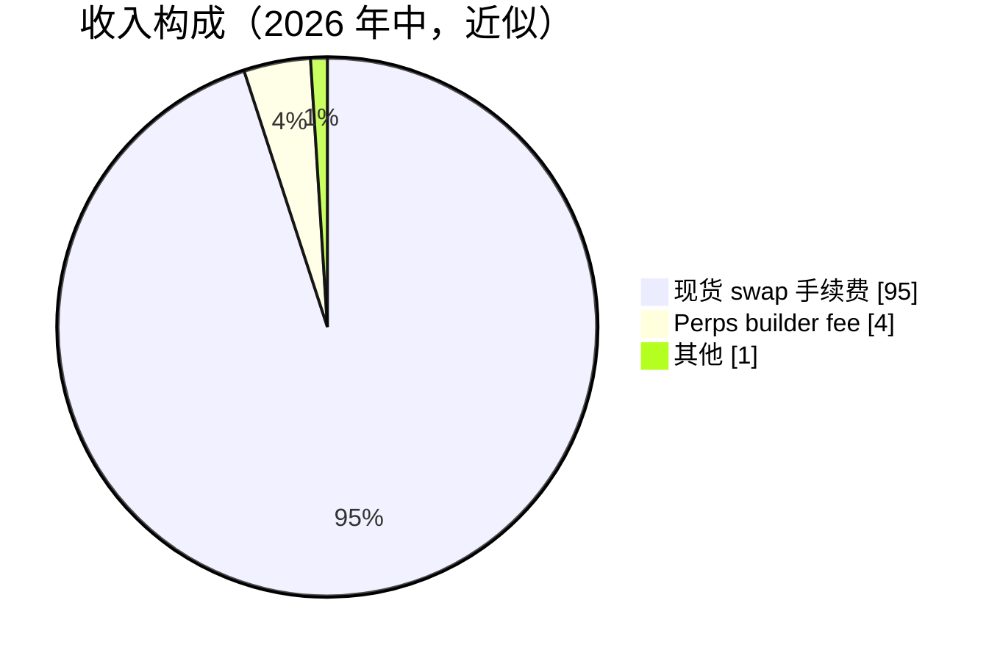
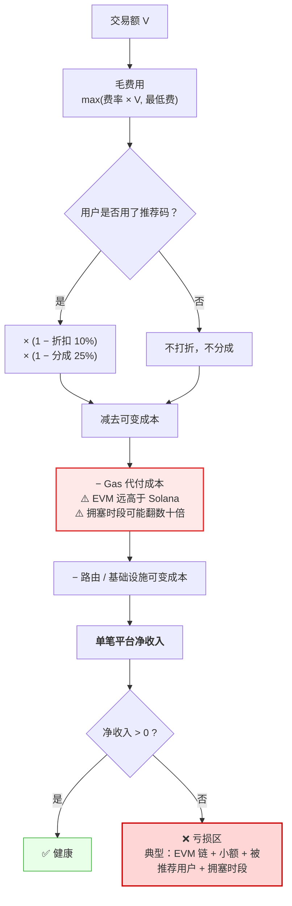

# 08 · 费用结构与商业模式

---

## 1. 费率表

**[官方条款 + 三方核实]**

| 产品 | 费率 | 说明 |
|---|---|---|
| **现货交易** | **不低于 0.50%**，每笔买入或卖出 | **最低 ~$0.95/笔**；条款保留采用其他费率的可能 |
| **永续合约（builder fee）** | **0.05% / 边** | 开仓和平仓各收一次 |
| **永续底层协议费** | ~0.045%（Hyperliquid taker） | 由底层场馆收取，非 fomo |
| **网络 Gas** | **$0** | 由 fomo 代付，全部支持链 |
| **入金** | 因通道而异 | Apple Pay / 卡走 Coinbase Onramp，支付方收费 |
| **推荐码折扣** | **-10%** 交易手续费 | 长期有效 |
| **推荐人分成** | 该用户手续费的 **25%** | **[三方]** 2026-06-02 公告 |

### ⚠️ 透明度问题

fomo 官网有一个专门讲交易成本的说明页，**但不写具体费率**。费率只出现在服务条款第 7 节。Datawallet 把这点明确列为 fomo 的弱项之一（措辞已改写）。

fomofamily.com 这个独立指南更直接：**现货费率是按笔报价而非公布固定比例，唯一权威的数字是你确认页上显示的那个**。

**自建建议**：把费率公开写在官网和 App 显著位置。这是零成本的差异化，而且是用户真正在意的事。

---

## 2. 最低费的杀伤力（最重要的一节）

### 2.1 盈亏平衡点

```text
0.005 × 交易额 = $0.95
            ↓
   交易额 = $190
```

**$190 以下，$0.95 的固定费取代百分比，实际费率急剧上升。**

### 2.2 实际费率曲线

| 交易额 | 收费 | **实际费率** | 用户感受 |
|---|---|---|---|
| $5 | $0.95 | **19.0%** | 荒谬 |
| $10 | $0.95 | **9.5%** | 劝退 |
| $20 | $0.95 | **4.75%** | 很贵 |
| $50 | $0.95 | **1.90%** | 偏贵 |
| $100 | $0.95 | **0.95%** | 尚可接受 |
| **$190** | **$0.95** | **0.50%** | ← 拐点 |
| $500 | $2.50 | 0.50% | 正常 |
| $1,000 | $5.00 | 0.50% | 正常 |
| $10,000 | $50.00 | 0.50% | 正常 |



拐点在 **$190**（`0.005 × 190 = 0.95`）。左侧是固定费统治区，实际费率随金额下降呈双曲线爆炸；右侧才是名义的 0.5%。



### 2.3 这个设计的真实含义

insights4.vc 给出的定性最准确（措辞已改写）：这是**用消费者的简单性替换区块链复杂性、但潜在经济代价高昂**的最清晰例子。

fomo 为什么必须这么做：**Gas 代付的固定成本**。一笔 $10 的交易，平台要代付 Gas、承担路由成本、承担基础设施成本 —— 如果只收 $0.05（0.5%），必然亏损。$0.95 是覆盖固定成本的底线。

**但用户不关心平台的成本结构。** 他们只看到 $10 的单子被收了 9.5%。

### 2.4 自建的四个可选方案

| 方案 | 做法 | 优点 | 缺点 |
|---|---|---|---|
| **A. 照抄** | 0.5% + 固定最低费 | 单位经济安全 | 小额用户体验差，口碑风险 |
| **B. 阶梯降额** | 最低费随交易额分档（如 <$20 收 $0.3，$20-100 收 $0.6） | 缓解极端情况 | 小额段仍亏，需要规模补贴 |
| **C. 小额不代付 Gas** | <$50 的单子让用户自付 Gas（Solana 上只有几分钱） | 成本对齐，费率可降到 0.3% | 破坏「零 Gas」的产品承诺 |
| **D. 设最低交易额** | 直接禁止 <$20 的交易 | 干净 | 挡掉新手试水单，伤转化 |

**推荐 B + C 的组合**：小额段（<$50）明确告知「本单 Gas 由你承担，约 $0.02」，费率收 0.3%。这样 $10 的单子总成本约 $0.05，用户体验远好于 $0.95，且平台不亏。

⚠️ 但要注意：这会让「零 Gas」变成「大额零 Gas」，需要清晰的文案设计。

---

## 3. 竞争定位：费率对比

| 平台 | 现货费率 | Gas | 全包成本 |
|---|---|---|---|
| **fomo** | 0.50%（推荐码 0.45%） | 平台代付 | **~0.5%** |
| **Axiom / GMGN** | 0.7% – 1% | **用户自付** | ~0.9%+（含优先费） **[三方]** |
| **Moonshot** | 阶梯式，小单更贵 | — | 小额段比 fomo 贵 |
| **直接用 DEX** | 0%（只有 DEX 池子费） | 用户自付 | 最低，但门槛最高 |

**fomo 的费率在同类交易终端里是有竞争力的** —— 0.5% 全包 vs 终端类产品加上优先费后接近 0.9%。

⚠️ 但相比直接在 DEX 上 swap，0.5% 明显更贵。这个差价买的是：法币入口 + Gas 代付 + 界面 + 社交层（[Datawallet](https://www.datawallet.com/crypto/fomo-app-explained) 的解释，措辞已改写）。

### Perps 的费率劣势

```text
fomo builder fee        0.05% / 边
Hyperliquid taker fee  ~0.045% / 边
────────────────────────────────────
全包                   ~0.095% / 边
```

约为**直接在 Hyperliquid 交易的两倍**。与 Phantom 相比中性（Phantom builder fee 也是 0.05%）。

**结论**：Perps 卖的不是价格，是「一个账户 + 社交层 + 移动端体验」。

---

## 4. 收入规模与隐含 take rate

### 4.1 披露数据

| 时点 | 交易量 | 收入 |
|---|---|---|
| 2026-06 | $500M / 月 | — |
| 2026-07 | $1.5B / 月 | — |
| 2026-07 第四周 | — | $1.57M / 周，其中约 $1.55M 来自 Solana swap **[DefiLlama]** |
| 2026-08-08 当周 | — | $2.64M / 周 **[DefiLlama]** |
| 2026-08（预计） | $2.8B+ / 月 | **~$17M / 月** |
| 年化 | — | **$200M+** |



两个月内交易量涨了 **5.6 倍**（$500M → $2.8B）。这条曲线的斜率决定了架构必须能横向扩展 —— 尤其是索引与扇出这两个环节。

排名参照 **[三方 Solana Compass / DefiLlama]**：
- 2026-07 中，按 7 日收入在全部 Solana 协议中排第三，仅次于 Pump.fun 和 Phantom CASH，**超过 Jupiter**（同期 $915K）
- 2026-07-11/12，按 24h 收入排第七，一度超过 Jupiter 和 Phantom
- 2026-08-08 当周收入比 Phantom 高 86%，接近 Jupiter 的三倍
- 一度在 24h 收入上超过 Hyperliquid

⚠️ DefiLlama 对 fomo 的口径：**全部费用由 App 自己收取，不区分协议与团队**。

### 4.2 隐含 take rate 的一个观察

```text
2026-08：$17M 收入 / $2.8B 交易量 = 0.607%
```

**这个数字高于 0.50% 的名义费率。** 可能的原因：

1. **$0.95 最低费的贡献显著** —— 说明有大量 $190 以下的小额交易，拉高了混合费率
2. Perps builder fee 计入
3. 交易量统计口径与收入口径不完全对应

无论哪种解释，**第 1 项最值得注意**：它意味着 fomo 的相当一部分收入来自小额交易的高费率段。这是一个**商业上有效但用户体验有代价**的结构。

自建时应该算清楚：**你的收入有多少来自「被最低费惩罚的小额用户」**？如果这个比例很高，说明商业模型建立在收新手的高费率上 —— 这不是一个可持续的口碑基础。

---

## 5. 成本结构（推断）

**[推断]** fomo 未公开成本，以下是基于架构的推演：

| 成本项 | 性质 | 规模估计 | 风险 |
|---|---|---|---|
| **Gas 代付** | 变动，随交易笔数 | 每笔几分到几毛（Solana 低，EVM 高） | ⚠️ **优先费飙升时失控** |
| **第三方基础设施** | Privy / Coinbase / DFlow / Relay / RPC / 数据 API | 随规模线性增长 | ⚠️ 单点定价权 |
| **Referral 分成** | **收入的 25%（针对被推荐用户）** | 巨大 | ⚠️ 挤压毛利 |
| **推荐码折扣** | 收入的 10%（针对用码用户） | 大 | — |
| **Trader Rewards** | 运营预算 | 有报道称 $2M 量级 **[未验证]** | — |
| **人力** | ~17 人（Series B 时） | 相对极小 | ✅ 最大的杠杆 |
| **云与数据存储** | 随索引自研上升 | 中 | — |

### 关键洞察：Referral 的 25% 是最大的毛利侵蚀项

如果一个用户是被推荐来的：



**被推荐用户的实际 take rate 只有 0.34%，比名义费率低 33%。**

fomo 显然认为这个代价值得 —— 因为 KOL 分发带来的增长速度（日新增 3 万）远超自然增长。但这也解释了为什么它不能再降费率：**0.5% 减去折扣和分成之后，留给平台的空间已经不大了。**

---

## 6. 收入构成（现状与展望）

### 现状



**[DefiLlama]** 2026-07 那一周 $1.57M 收入中约 $1.55M 来自 Solana 上的自托管 swap —— 高度单一。

### 潜在扩展方向（fomo 战略愿景 **[三方 iq.wiki]**）

fomo 的长期愿景是成为**代币化股票、衍生品和其他链上资产的入口**。Galaxy 的研究提到它正在整合 perps、预测市场，以及**闲置余额的收益（yield）**。

可能的收入线：

| 收入线 | 机制 | 状态 |
|---|---|---|
| 现货手续费 | 0.5% | ✅ 主力 |
| Perps builder fee | 0.05%/边 | ✅ 2026-06 上线 |
| 代币化股票 | Robinhood Chain 资产 | ✅ 2026-07 |
| **预测市场** | builder fee | 🔜 Galaxy 提到在整合 |
| **闲置余额收益** | 余额生息，平台抽成 | 🔜 Galaxy 提到 |
| 代币发行 | 原生代币 / 空投 | ❓ 截至 2026 年中官方未宣布，CoinLaunch 猜测未来可能 **[未验证]** |
| 订阅 / Pro 功能 | 高级图表、限价单、数据 | ❓ 未见 |
| 广告 / 项目方付费曝光 | 代币推广位 | ❓ 未见（与「可信社交」定位冲突） |

**「闲置余额生息」是最值得抄的一条**：用户余额以 USDC 形式躺着，接入借贷协议或国债代币产生收益，平台抽成。这是零边际成本的收入，且对用户是净增益（现在是 0 收益）。

⚠️ 但它有明确的合规含义 —— 在很多司法辖区，向散户提供生息产品会触发证券监管。

---

## 7. 单位经济模型（自建时的计算模板）



### 示例：$100 的交易

| 情形 | 计算 | 平台净收入 |
|---|---|---|
| 自然用户，Solana | $0.95 - $0.02(gas) - $0.01(infra) | **+$0.92** |
| 被推荐用户，Solana | $0.95 × 0.9 × 0.75 - $0.03 | **+$0.61** |
| 自然用户，EVM（Base） | $0.95 - $0.15(gas) - $0.01 | **+$0.79** |
| 被推荐用户，EVM 拥塞时 | $0.95 × 0.9 × 0.75 - $0.60(gas 飙升) | **+$0.04** |

### 示例：$10 的交易（无最低费的情况）

| 情形 | 计算 | 平台净收入 |
|---|---|---|
| 收 0.5% = $0.05，Solana | $0.05 - $0.02 - $0.01 | **+$0.02**（几乎不赚） |
| 收 0.5% = $0.05，EVM | $0.05 - $0.15 - $0.01 | **-$0.11**（亏） |
| 被推荐 + EVM 拥塞 | $0.05 × 0.675 - $0.60 | **-$0.57**（大亏） |

**这就是为什么必须有最低费。** 也说明 **EVM 链上的小额交易是纯亏损业务** —— 自建时应考虑对 EVM 小额单不代付 Gas。

### 必须建的成本看板

按维度实时监控 Gas 代付支出：
- 按链（Solana 便宜、EVM 贵）
- 按时段（拥塞时段成本飙升）
- 按交易额分档（小额是亏损源）
- 按用户分层（识别刷量套利）
- 按用户来源（自然 vs 推荐，毛利差 33%）

---

## 8. 融资与估值

**[官方 + 三方]**

| 轮次 | 时间 | 金额 | 领投 | 备注 |
|---|---|---|---|---|
| Pre-Seed | 2025-02-18 | **$2M** | 140+ 天使 | 从 200 人精选名单里拿到约 140 位；含 Balaji Srinivasan（前 Coinbase CTO）、Raj Gokal（Solana）、Marc Boiron（Polygon Labs） |
| Series A | 2025-11-06 | **$17M** | **Benchmark** | Benchmark 自 2018 年以来首笔重要消费级加密投资 **[三方]** |
| Series B | 2026-06-22 | **$75M** | **Index Ventures** | USV + Benchmark 跟投；估值 **$550M** |
| 累计 | | **~$94M** | | |

Series B 天使名单里的名字很说明问题：Mark Pincus（Zynga 联创）、Kevin & Julia Hartz（Eventbrite）、Humam Sakhnini（Discord CEO）、Tomas Okmanas、Sebastian Knutsson（King）—— **全部来自消费级软件和游戏，不是加密行业**。

fomo 自己的表述：Index、USV、Benchmark 有支持定义品类的消费金融与社交平台的历史记录（Robinhood、Coinbase、Snapchat、Instagram、Twitter）。

**这印证了定位**：fomo 被投资人当作消费级社交产品，而不是 DeFi 协议。

### 收购

| 时间 | 标的 | 金额 | 内容 |
|---|---|---|---|
| 2026-08-31 | **Mobula** 的软件与 IP | 约 **$17M**（Axios 引 CEO 口径，官方公告未披露金额） | 链上数据基础设施；创始人 Sacha Marcus、CTO Sacha Delhoux（成交时 19 岁）、基础设施负责人 Cyril Conan 加入 |

**注意交易范围的精确界定**：fomo 官方公告确认收购的是 Mobula 开发的**软件与知识产权**，同时引入部分核心团队成员 —— 不是整体收购公司 **[三方 Odaily]**。

---

## 9. 商业模型的结构性判断

### ✅ 优势

1. **极高的运营杠杆** —— 17 人做到年化 $200M。执行层外采换来的。
2. **零边际成本的收入** —— 每笔交易的抽成，边际成本只有 Gas 和 API 调用。
3. **增长外包给 KOL** —— 25% 分成把分发成本变成了变动成本，不用烧广告预算。
4. **多资产扩展成本极低** —— Perps 只是接 API。未来接预测市场同理。
5. **不需要牌照** —— 非托管 + 不撮合 + 不做 KYC。2026-03 SEC 与 CFTC 把经纪商注册豁免延伸到非托管接口提供方，这正是 fomo 所处的类别 **[三方 Datawallet]**。

### ⚠️ 风险

1. **收入高度单一** —— 95%+ 来自现货 swap 手续费，且高度依赖 Memecoin 投机热度。市场转冷，收入直接腰斩。
2. **交易量跟随链上热点漂移** —— Robinhood Chain 三个月占到 75%，说明忠诚度在链而不在平台。下一个热点在别的地方，量可能一样快地走。
3. **Gas 代付是不封顶的成本敞口** —— 优先费飙升时无法转嫁。
4. **护城河未被证明** —— 社交图谱的网络效应缺乏公开数据支撑；CEO 自己承认产品仍偏交易。
5. **竞争从两侧夹击** —— Robinhood、Coinbase、Phantom、eToro 都在朝「执行 + 可验证活动 + 社交发现」的组合靠拢。
6. **单点依赖** —— Privy 挂了全站停摆；DFlow 已被 MoonPay 收购。
7. **小额用户的费率口碑** —— $10 单收 9.5%，长期会成为负面口碑源。
8. **监管不确定性** —— 不做 KYC、无经纪商注册，信任建立在代码和公司本身而非任何监管机构上 **[三方]**。

### 对自建的建议

**抄什么**：运营杠杆（外采执行层）、KOL 分发机制、零 Gas 体验、社交默认公开。

**改什么**：
1. **费率透明** —— 公开写清楚，这是零成本差异化
2. **小额费率结构** —— 用「小额自付 Gas + 低费率」替代高额最低费
3. **收入多元化要早** —— 闲置余额生息是最容易加的第二条腿
4. **执行质量披露** —— 主动展示报价 vs 实际成交偏差，对标 fomo 的透明度短板
5. **多供应商** —— 路由、桥、入金通道都至少接两家

---

> 本文档中对第三方内容的引用均已改写以符合授权限制（Content was rephrased for compliance with licensing restrictions）。
