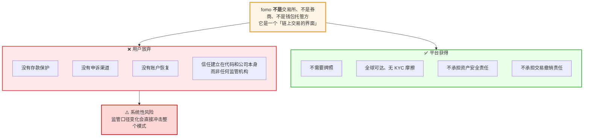
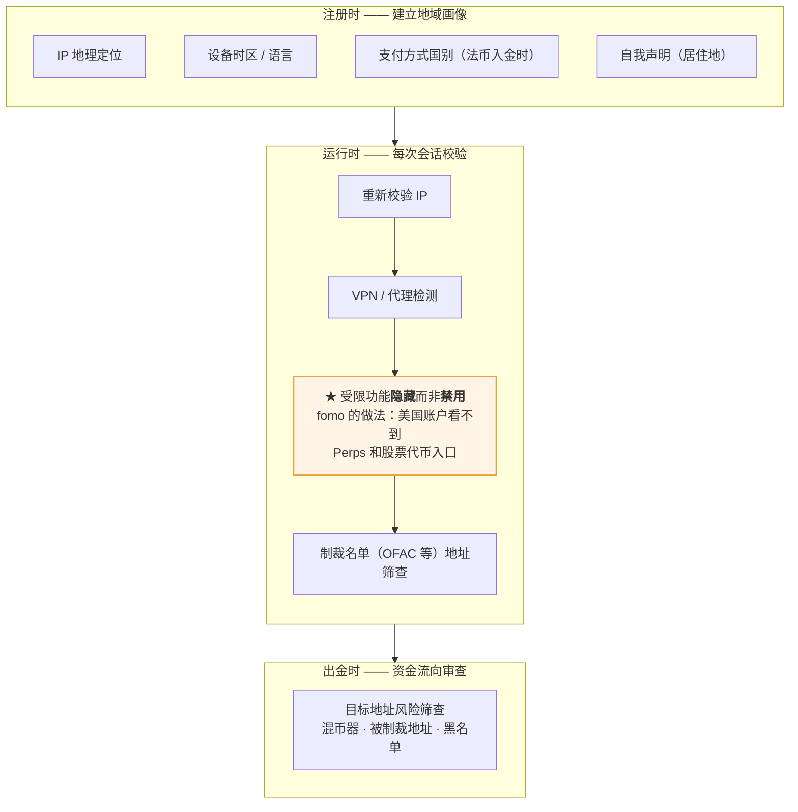
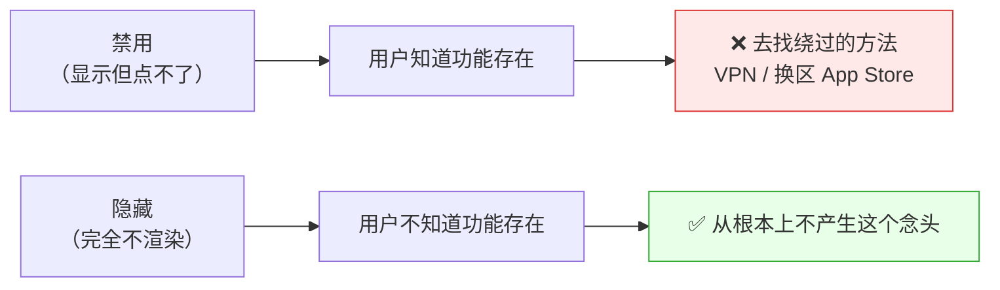
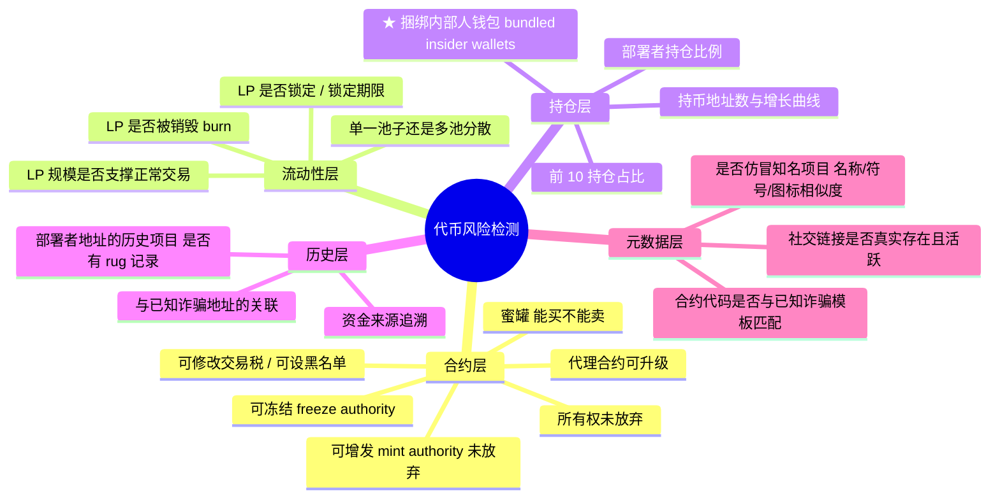
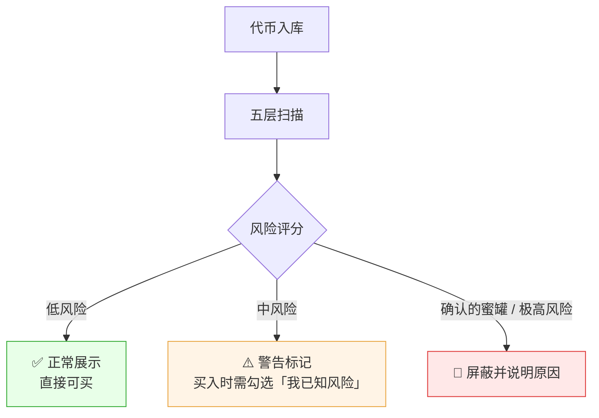
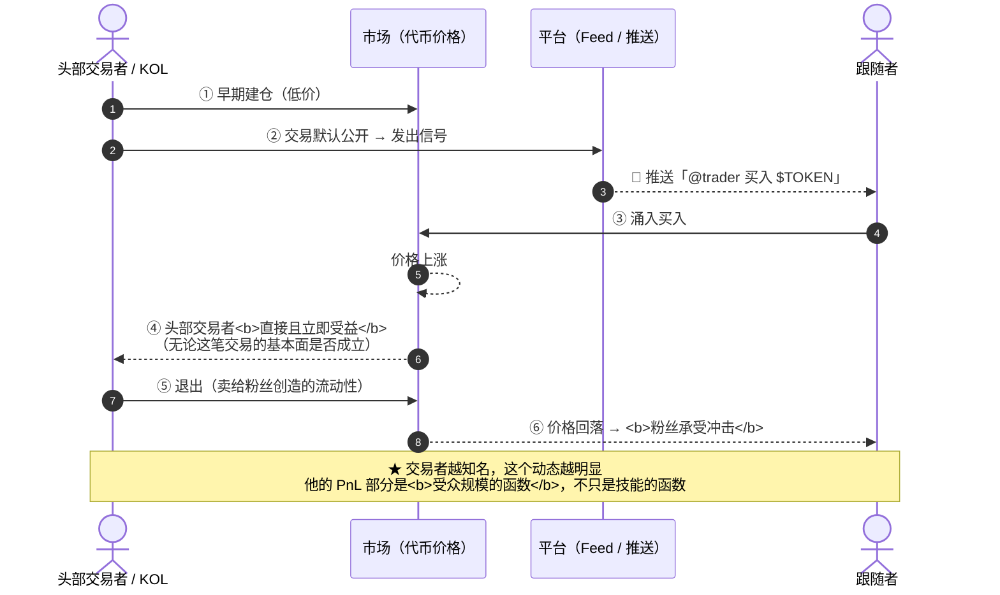
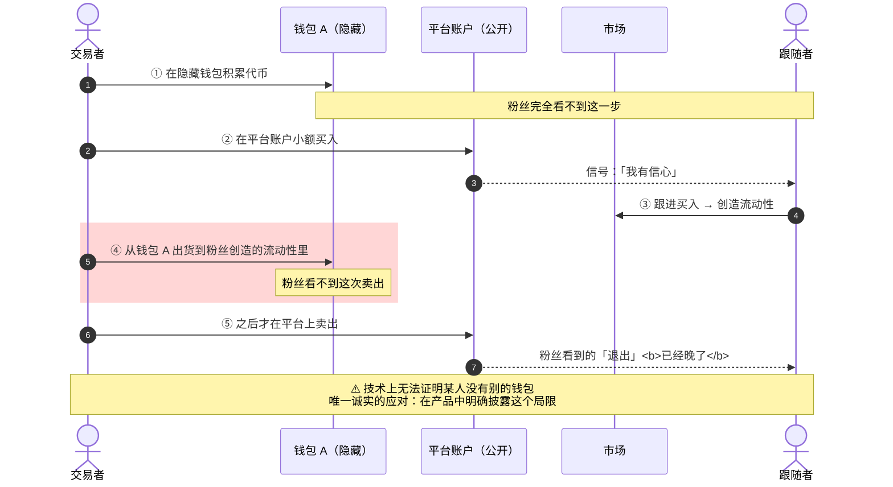

# 10 · 风险合规与安全

---

## 1. 监管定位：非托管接口提供方

### 1.1 fomo 的合规姿态

**[官方 + 三方]**

| 维度 | fomo 的选择 |
|---|---|
| 资产托管 | **不托管**（嵌入式自托管钱包） |
| 撮合 | **不做内部订单簿**，链上对着 DEX 流动性成交 |
| KYC | **交易不做身份验证** |
| 经纪商注册 | **未注册** |
| 永续合约 | **外采第三方协议**，不自营 |
| 法币通道 | **外采**，KYC 责任在支付方 |

**[三方 Datawallet]** 2026-03，SEC 与 CFTC 发布的指引把经纪商注册豁免延伸到**非托管接口提供方** —— 这正是 fomo 所处的类别。

### 1.2 这个姿态的本质



fomotrading.app 的表述值得记住（措辞已改写）：**fomo 不是交易所也不是经纪商，这一点值得说清楚。** 每笔交易都从用户独自控制的钱包直接走链上流动性池 —— 中间没人持有你的钱，这也意味着没人能冻结它。

### 1.3 对自建的判断

**这条路径可走，但要清楚代价**：

| 你获得 | 你放弃 |
|---|---|
| 不需要交易所/券商牌照 | 无法提供账户恢复、无法撤销交易 |
| 全球市场准入 | 无法进入需要持牌的业务（法币托管、生息产品） |
| 极低的合规成本 | 监管政策变化的尾部风险 |
| 快速上新资产 | 无法为用户损失提供任何补偿 |

⚠️ **各司法辖区差异极大。** 上述 SEC/CFTC 的豁免是美国口径。欧盟 MiCA、英国 FCA、新加坡 MAS、香港 SFC 的处理方式各不相同，**必须做单独的法律意见**。本文档不构成法律建议。

---

## 2. 地域限制

**[官方]** fomo 的原则：**限制跟着市场走，不跟着 App 走。**

| 产品 | 美国用户 | 说明 |
|---|---|---|
| 现货交易 | ✅ 可用 | 全球可用，含美国 |
| **Perps** | 🚫 **屏蔽** | 第三方协议提供，**不向美国人开放**（公民、居民、以及任何身处美国境内的人） |
| **代币化美股**（Robinhood Chain） | 🚫 屏蔽 **[三方]** | 底层场馆要求 |
| 法币银行提现 | 主要限美国用户 **[三方]** | 反向的地域限制 |

fomo 官方的措辞相当强硬：**不要试图从美国境内访问 perps。**

### 架构含义

**外采架构会把合规限制直接传导给你。** 你用 Hyperliquid 做 Perps，Hyperliquid 的限制就是你的限制。这是外采模式的隐性成本，在做技术选型时必须算进去。

### 自建必做的地域控制



⚠️ **「隐藏」比「禁用」更好** 的原因：



⚠️ **「隐藏」比「禁用」更好**：禁用会让用户去找绕过的方法，隐藏则从根本上不产生这个念头。

---

## 3. 非托管的真实含义（必须对用户说清楚）

### 3.1 自托管消除了什么

| 风险 | 为什么消除 |
|---|---|
| 平台跑路 / 破产 | 资产在链上，由用户密钥控制 |
| 平台冻结账户 | 平台无法单方面动用资金 |
| 平台被黑导致资产被盗 | 平台不持有完整密钥 |
| 助记词被钓鱼 / 截图 | 没有助记词 |
| SIM-swap | 认证不用手机号 |
| 无限额合约授权滥用 | 不需要签 blanket approval |

### 3.2 自托管带来了什么（这部分产品往往说得不够）

**[三方 Datawallet，措辞已改写]** 这个结构有一个无法回避的后果：因为平台从不托管资产，所以它**无法撤销交易、无法恢复丢失设备的访问权、也无法在代币归零时给你补偿**。

具体清单：

| 风险 | 说明 | 用户能做什么 |
|---|---|---|
| **无存款保护** | 没有 FDIC、没有申诉专员、没有赔偿机制 | 只投入可以全部损失的金额 |
| **丢设备风险** | 从未导出私钥且丢失设备，可能**永久失去余额** | **一定要导出私钥并妥善保管** |
| **交易不可撤销** | 上链即终局 | 交易前核对 |
| **邮箱被攻破** | 邮箱是钱包入口 | 强密码 + 双因素 |
| **代币归零不赔** | 绝大多数链上发行的代币最终归零 | 检查安全数据 |
| **卖出可能失败** | 有评测反映买入容易、卖出失败，尤其薄流动性代币 | 关注流动性指标 |

### 3.3 一句必须诚实的话

**「合法」和「安全」是两个不同的问题。**

Datawallet 的结论（措辞已改写）：fomo 是合法的，也大致是一个自托管链上应用能做到的安全程度。但它仍然带有智能合约风险和代币风险，且**没有任何监管方面的兜底**。

自建产品的风险披露应该达到同样的诚实程度。

---

## 4. 代币风控

### 4.1 fomo 的做法

**[官方]** 2025-09 上线代币安全警告。**所有资产都能买**，但平台会对疑似恶意代币打警告标记。

代币页展示的风险信号：
- 持仓分布（holder composition）→ 判断集中度
- 流动性、市值
- 项目社交链接（可核验真实性）
- 安全警告标记

⚠️ **具体检测规则从未公开。** 这既是商业机密，也有现实考虑 —— 规则公开就会被绕过。

### 4.2 完整的检测项清单（行业通行 + 推断）



⭐ **捆绑内部人钱包（bundled insider wallets）** 是 Datawallet 特别强调的一项：买入前检查这个能筛掉最明显的陷阱（措辞已改写）。fomo 目前没有这个功能，是自建的差异化机会。

评分与拦截的判定流程：



⚠️ fomo 的做法是「全部可买 + 警告标记」，没有第三档。建议自建时加上屏蔽档 —— 对确认的蜜罐不应该还提供买入按钮。

### 4.3 产品设计的关键取舍

| 策略 | 优点 | 缺点 |
|---|---|---|
| **全部可买 + 警告标记**（fomo 的做法） | 不错过任何机会；不需要做审查决策 | 用户可能忽略警告 |
| **高风险币需二次确认** | 增加摩擦，减少误买 | 降低转化 |
| **直接屏蔽极高风险币** | 最保护用户 | 变成审查者；会错过真机会；被指责中心化 |

**建议**：分三档 —— 正常币直接买、警告币需滑动确认时勾选「我已知风险」、极高风险币（确认的蜜罐）屏蔽并说明原因。

---

## 5. 社交交易特有的风险

这是 fomo 这类产品最独特、也最难解决的风险类别。以下基于 [Galaxy Research](https://www.galaxy.com/insights/research/social-trading-fomo)（措辞已改写）。

### 5.1 羊群效应（Groupthink）

**机制**：当交易活动高度可见、且距离执行只有一次点击时，从众行为会被放大。经验较少的用户倾向于过度加权知名交易者的行为，在高交易量和高波动时期尤其如此。

**为什么比以前更严重**：这在加密领域不是新现象，但**社交信息流把反馈回路压缩了**。以前需要找到钱包地址、导入追踪器、手动执行；现在几秒钟就完成。

**速度是产品的卖点，也正是它让无信息跟随变得如此容易。**

### 5.2 出货流动性问题（Exit Liquidity）

**机制**：社交交易在头部交易者 / KOL 与其跟随者之间创造了一个**固有的不对称结构**。



**最关键的一句**：交易者越是知名、越是受欢迎，这个动态就越明显 —— **他的 PnL 部分是受众规模的函数，而不只是技能的函数。**

平台可以展示平均持仓时长一类的指标帮助用户识别激励错配，但**只要可见性驱动资本流动，这个不对称就是内生的**。

### 5.3 透明度问题（多钱包操纵）

**机制**：一个交易者在单个平台上的活动**不必然反映他的完整仓位**。



**这是「可验证的持仓」这个卖点的根本边界** —— 平台能证明「这个账户通过我们开了这个仓」，不能证明「这个人的全部仓位就是这些」。

**这种操纵容易执行、且跟随者难以察觉。** 技术上无法解决 —— 你无法证明某人没有别的钱包。

**唯一诚实的应对是在产品中明确披露这个局限。**

### 5.4 时间尺度压缩

**机制**：Solana 上的平均持仓时长已经在大幅下降。当你能实时看到关注的交易者刚退出某个仓位时，立刻卖出的冲动比在不透明环境中更强烈。

**长期后果**：整个用户群被推向越来越短的持仓周期，**这有利于最快的超高频剥头皮者，不利于其他所有人**。

### 5.5 金融的游戏化

**机制**：让体验变得吸引人的那些手法 —— 排行榜、美观的 PnL 分享、实时信息流 —— **大量借用了成瘾性产品设计的方法论**。

Galaxy 的原话（措辞已改写）：**这个模式之所以有效，部分原因在于它让交易感觉起来不像实际上那么有后果。**

### 5.6 风险对策矩阵

| 风险 | 技术/产品对策 | 代价 | 是否值得 |
|---|---|---|---|
| 羊群效应 | Feed 排序降低「仓位显著性」权重；对被大量跟随的代币加风险提示 | 降低转化率 | ✅ 建议做 |
| 出货流动性 | **展示「该交易者的跟随者平均收益」** | 头部用户强烈反对 | ✅ 最诚实的功能 |
| 多钱包操纵 | **无法技术解决**；在 Profile 上明示「单账户记录不代表完整仓位」 | 无 | ✅ 必做 |
| 时间尺度压缩 | 平仓事件延迟广播 30–60s；突出平均持仓时长；做「长期持有者榜」 | 削弱实时感 | ⚠️ 需权衡 |
| 游戏化成瘾 | 推送频控；亏损同等显著；冷静期；自设交易限额 | 降低活跃度 | ✅ 建议做 |

---

## 6. 平台运营风险

### 6.1 单点依赖

见 [04 系统架构拆解](04-系统架构拆解.md#6-单点依赖风险图)。核心风险：

| 依赖 | 故障后果 | 等级 |
|---|---|---|
| **Privy**（钱包/签名） | 无法登录、无法签名 = **全站停摆** | P0 |
| **DFlow**（Solana 路由） | Solana 交易不可用（占历史交易量大头） | P0 |
| **Relay**（跨链） | 统一余额失效 | P1 |
| **Coinbase Onramp** | 法币入金不可用（新用户获取中断） | P1 |
| **Hyperliquid / Trade[XYZ]** | Perps 不可用 | P1 |

⚠️ 现实案例：**DFlow 在 2026-05 被 MoonPay 以约 $100M 全股票收购** **[三方]**。基础设施商被收购后，服务条款、定价、优先级都可能变化。

### 6.2 执行质量问题（fomo 的实际投诉点）

**[三方]** 公开评测与应用商店评论中反复出现：

| 问题 | 影响 |
|---|---|
| **卖出失败 / 延迟** | 买入顺畅但卖出失败，尤其薄流动性代币。这是最伤信任的问题 |
| **PnL 不准** | 公开排行榜的排序依据，出错就是信任事故 |
| **登录 / 入金问题** | 直接影响转化 |
| **客服模板化回复** | Trustpilot 上有少量一星评论提到 |

insights4.vc 的定性（措辞已改写）：这些证据不能说明问题的普遍程度，但**它们指出了「无缝券商体验」这个承诺会在哪里破裂**。

### 6.3 仿冒与钓鱼

**[三方]** 已知的攻击：

| 类型 | 案例 |
|---|---|
| **域名仿冒** | `fomoo.family`（双 o）—— 会清空连接的钱包。这种一个字母的差异在社交贴文、短链接、手机浏览器里极难察觉 |
| **克隆 App** | App Store / Google Play 上有仿冒应用 |
| **假 Telegram Bot** | **fomo 没有官方 Telegram bot**，任何用这个名字的 bot 都不是官方的 |

fomo 的防护措施：官方渠道反复强调核对开发者名（FOMO Labs, Inc.）与官方域名。

**自建必做**：
- 官网首屏 + App 内显著位置放官方域名/开发者名核验提示
- 注册常见拼写变体域名
- 持续监控仿冒域名与应用，及时投诉下架
- 明确公告「我们没有 Telegram bot / 我们不会索要私钥」

---

## 7. 安全建议（可直接写进产品帮助中心）

### 给用户的

**[官方 fomo 的建议 + 补充]**

1. **保护好邮箱** —— 它实际上是钱包的入口。强密码 + 双因素认证
2. **保持生物识别开启** —— 不要为了方便关掉
3. **导出并妥善保管私钥** —— 这是丢设备时唯一的救命绳
4. **私钥按银行密码对待** —— 不分享、不明文存、不截图
5. **警惕钓鱼** —— 平台**永远不会**通过任何渠道索要私钥、密码或助记词
6. **保持设备系统更新**
7. **核对官方域名与开发者名**
8. **只投入可以全部损失的金额**
9. **每次买入前检查代币安全数据**
10. **把 Feed 当发现工具，不要当买入信号**

第 10 条来自 Datawallet 的建议（措辞已改写），值得放在产品里显眼的位置。

### 给平台的

| 领域 | 措施 |
|---|---|
| **密钥** | 外采成熟方案；不自建 MPC/TEE；必须支持导出 |
| **签名权限** | 出金、导出密钥强制生物识别；交易不卡（体验） |
| **出金** | 地址风险筛查、制裁名单、单笔/日限额、新地址冷静期 |
| **交易** | 滑点上限、代币安全前置校验、幂等、状态机持久化 |
| **Gas 代付** | 单笔上限、频率限制、异常模式检测、实时成本看板 |
| **反刷** | 关联账户识别（设备/IP/资金来源）、返佣审核、奖励延迟发放 |
| **依赖** | 关键路径多供应商 + 自动 failover；明确降级策略 |
| **监控** | 交易成功率、端到端延迟、Gas 支出、卖出失败率按代币分层 |
| **审计** | 智能合约（Paymaster、账户实现）第三方审计;定期渗透测试 |
| **事故响应** | 明确的状态页、事故公告机制、用户补偿政策（哪怕是「不补偿」也要写清楚） |

---

## 8. 风险披露清单（自建产品必须明示的内容）

把这些写进注册流程、风险页和帮助中心。**不要藏在服务条款第 7 节里。**

```text
关于你的资产
  □ 这是自托管钱包。我们无法访问、转移或冻结你的资产
  □ 我们无法撤销任何已上链的交易
  □ 如果你丢失设备且从未导出私钥，你可能永久失去资产
  □ 没有存款保护、没有赔偿机制、没有申诉专员
  □ 你的邮箱账户是钱包入口，请务必保护好

关于费用
  □ 现货交易费率：X%，最低 $Y/笔
  □ 小额交易的实际费率会显著高于 X%（附费率曲线图）
  □ Gas 由我们承担 / 或：小额交易 Gas 由你承担
  □ 入金由第三方支付方处理，费用另计

关于交易
  □ 交易在链上对着去中心化流动性成交，可能出现滑点、价格冲击、失败
  □ 薄流动性代币可能难以卖出
  □ 我们的报价不保证成交价
  □ 现货不支持限价单和止损单

关于社交功能
  □ 他人的公开交易记录不代表其完整仓位 ★
  □ 他人可能在我们平台之外持有相反的仓位 ★
  □ 跟随他人交易不保证获得相似结果
  □ 跟随我们平台头部交易者的用户，历史平均收益为 ___ ★★
  □ 排行榜排名不构成推荐或投资建议

关于资产
  □ 绝大多数链上发行的代币最终会归零
  □ 我们标记风险但不做审查，所有买入决策由你负责
  □ 稳定币存在脱锚和发行方风险

关于永续合约（如提供）
  □ 由第三方协议提供，不向 ___ 地区用户开放
  □ 杠杆仓位可能被强平，你可能损失全部保证金
  □ 存在资金费率成本和预言机风险

关于监管
  □ 我们不是交易所、不是经纪商、未注册为持牌机构
  □ 我们不做身份验证（支付合作方可能做）
  □ 你所在地区的法律可能限制或禁止这些活动
```

★ 标记的三条是 fomo 做得不够、而**对用户最重要**的披露。
★★ 这一条如果敢做，就是真正的差异化。

---

## 9. 一个诚实的总结

fomo 确实解决了一个难题：让非技术用户能用上链上交易，而且过程不成为障碍。移除助记词、跨链桥和 Gas 管理是在消除真实的摩擦，不是重新包装摩擦。

但**它把复杂性藏起来了，没有消除它**。托管风险、市场冲击风险、协议风险都还在。

insights4.vc 提出的判断标准是最好的自检问题：

> **不是「用户是否看到了区块链」，而是「在抽象之后，费用、执行质量、资产风险和亏损机制是否依然可以被理解」。**

做自建产品时，把这句话贴在墙上。

---

> 本文档不构成法律、税务或投资建议。各司法辖区的监管要求差异极大，实际运营前必须取得专业法律意见。
>
> 本文档中对第三方内容的引用均已改写以符合授权限制（Content was rephrased for compliance with licensing restrictions）。
