# 11 · 自建路线图与技术选型

> 本文档是把前 10 篇的拆解结论转成可执行的立项方案。所有排期与人力估算基于「有经验的团队、全职投入」的假设。

---

## 1. 三条战略前提

在写任何代码之前，这三件事必须先定下来。

### 前提一：不要造执行层

fomo 用 17 人做到年化 $200M 收入，**唯一的原因是执行层全部外采**。

| 不要自建 | 理由 | 用什么 |
|---|---|---|
| 钱包密钥系统 | 3–5 名密码学工程师 × 12 个月 + 审计，出事就是资产级事故 | Privy |
| 跨链桥 | 历史上被盗金额最大的一类基础设施 | Relay / LiFi |
| DEX 路由聚合 | 完全商品化 | Jupiter / 0x / LiFi |
| 法币入金 | 需要支付牌照、KYC、反欺诈 | MoonPay / Transak |
| 永续撮合清算 | 等于变成交易所 | Hyperliquid builder codes（或不做） |
| K 线图表 | 用户已有肌肉记忆 | TradingView |
| 链上数据索引（第一年） | 5–8 人的长期投入 | Birdeye / Helius / Codex |

**省下来的人全部投到社交图谱和客户端体验上。**

### 前提二：社交图谱必须自研，且是最大投入

这是唯一买不到的东西，也是 fomo 的护城河所在（虽然尚未被证明）。

具体包括：关注图谱、Feed 生成与排序、Thesis、评论、排行榜、Clan、通知扇出、持仓与 PnL 计算。

⚠️ **PnL 计算口径必须在写第一行代码前定死。** 它是排行榜的排序依据，改口径 = 所有历史数据失真 = 公开的信任事故。

### 前提三：先定价值观，再写代码

这类产品有一组无法回避的取舍：

| 选择 | 增长 | 用户利益 |
|---|---|---|
| Feed 高权重「仓位显著性」 | ↑↑ | ↓↓（羊群效应） |
| 实时平仓广播 | ↑ | ↓（踩踏） |
| 不限推送频率 | ↑↑ | ↓↓（冲动交易） |
| 只突出赢单 | ↑↑ | ↓↓（扭曲期望） |
| 展示跟随者平均收益 | ↓↓ | ↑↑ |
| 高额最低费 | 收入 ↑ | ↓（小额用户被收 9.5%） |

**这些不是技术问题，是产品决策。** 建议在立项文档里明确写下你选了哪一边，并让全团队知道。含糊处理的结果一定是默认选增长。

---

## 2. MVP 范围定义

### 2.1 P0：核心循环（缺一不可）

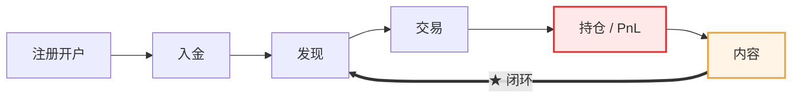

| 模块 | 具体范围 | 备注 |
|---|---|---|
| **A 账户** | 邮箱 + Apple ID 登录；嵌入式钱包；生物识别；用户主页 | 用 Privy |
| **B 资金** | 法币入金；加密入金（USDC）；统一美元余额；出金 | 入金用 MoonPay/Transak |
| **C 发现** | 全局 Feed；代币详情页；搜索（名称 + CA）；排行榜 | **排行榜是 P0** —— 新用户靠它解决「关注谁」 |
| **D 交易** | 现货 swap（滑动买入 + 美元预设）；Gas 代付；实时 PnL；TradingView 图表 | 单链起步 |
| **E 社交** | 关注；Thesis；评论 | Thesis 是护城河起点，不要延后 |
| **F 增长** | Referral（分成 + 折扣） | 归因链路要一次做对 |
| **G 风控** | 代币安全警告；出金生物识别；地域控制 | 安全数据可先用三方 API |

### 2.2 明确不做（第一阶段）

| 不做 | 理由 |
|---|---|
| 多链 | 先在一条链上把体验做到极致。**建议从 Solana 起步**（费用低、Memecoin 活跃、工具链成熟） |
| Perps | 工程量不大，但合规复杂度、地域屏蔽、风险披露是量级跃升 |
| 自建数据索引 | 用三方 API，量级上来再说 |
| 限价单 / 止损 | fomo 都没做，虽是需求但不是 MVP |
| Clans | 留存机制，等有了基数再做 |
| Trader Rewards | 需要先有内容生态 |
| Web 版 | 移动端优先。fomo 是第 12 个月才出 Web 的 |

---

## 3. 技术选型

### 3.1 客户端

| 方案 | 优点 | 缺点 | 建议 |
|---|---|---|---|
| **React Native (Expo)** | 一套代码双端；迭代快；Privy SDK 支持好 | 复杂动画和图表性能有上限 | ✅ **MVP 推荐** |
| Flutter | 性能好、UI 一致性强 | Web3 生态 SDK 支持弱于 RN | 备选 |
| 原生 iOS + Android | 体验天花板最高（fomo 的选择） | 人力翻倍 | 规模后再迁移 |

**建议**：MVP 用 React Native，把省下的人力投到社交层。等 PMF 验证后，如果体验成为瓶颈再考虑原生重写关键路径。

Web 版用 **Next.js**，第二阶段再做。

### 3.2 后端

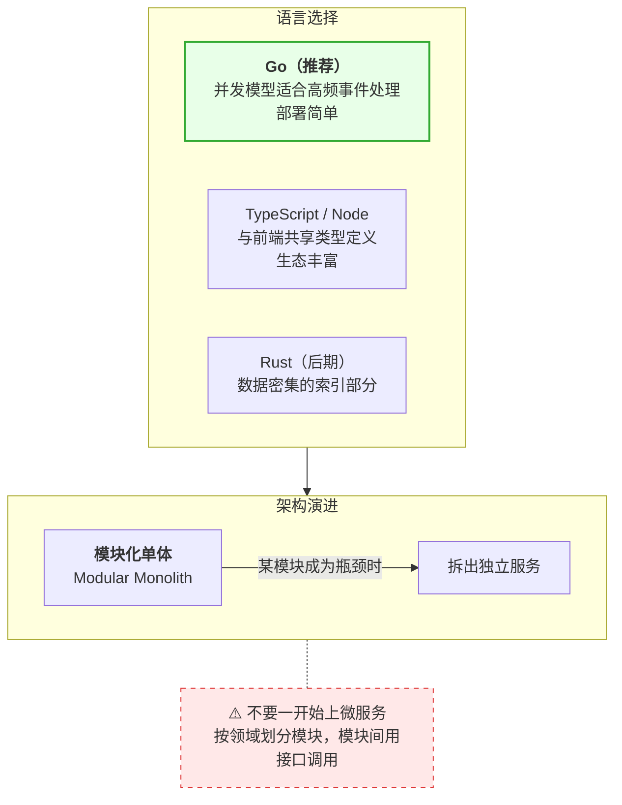

**模块划分**（对应 [04 架构文档](04-系统架构拆解.md)）：

目录结构：

```text
/internal
  /identity      认证、用户、钱包编排
  /funding       入金、出金、余额归集、风控
  /trading       报价、路由、交易构造、状态机
  /portfolio     持仓、成本基准、PnL 计算   ★ 口径核心
  /market        代币元数据、价格、安全评分（第一阶段封装三方 API）
  /social        关注、Feed、Thesis、评论、排行榜
  /notify        推送扇出、频控、去重
  /growth        Referral、归因、返佣结算
  /admin         风控后台、运营工具
```

模块依赖方向（**箭头方向就是允许的 import 方向，反向依赖一律禁止**）：

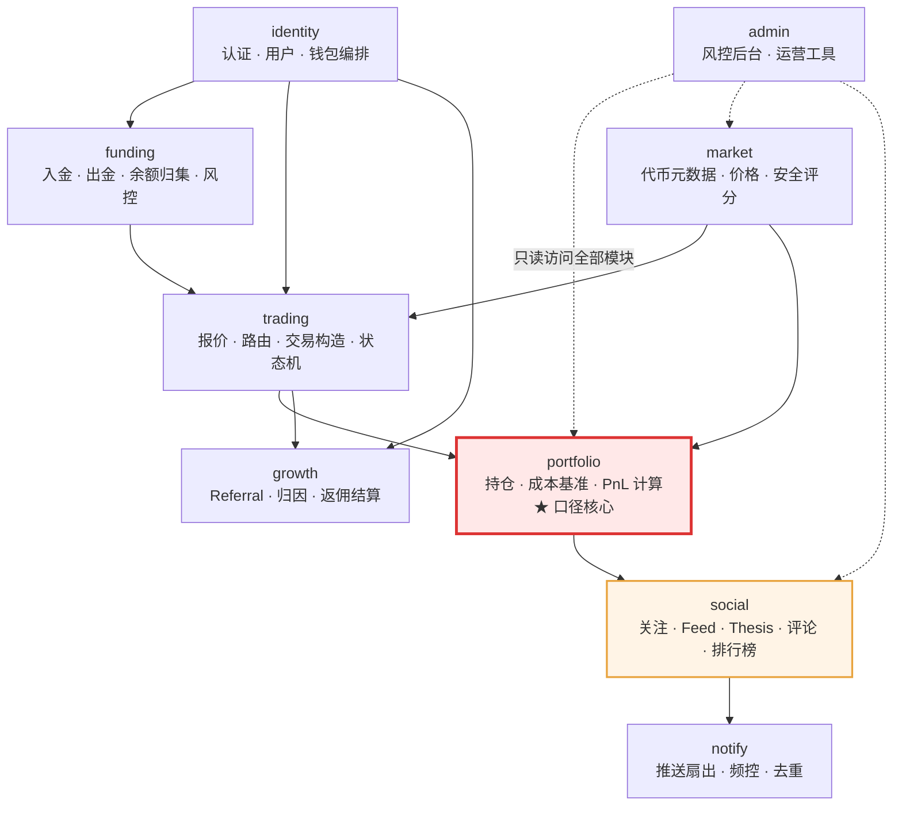

⚠️ 关键约束：**`social` 只能依赖 `portfolio`，不能反向。** 社交层读持仓和 PnL，但持仓计算绝不能因为社交需求而改口径 —— 这是防止 PnL 口径被业务需求侵蚀的架构护栏。

### 3.3 数据存储

| 用途 | 选型 | 说明 |
|---|---|---|
| 关系数据 | **PostgreSQL** | User / Follow / Trade / Position / Thesis / Comment |
| 热数据与缓存 | **Redis** | 实时价格、持仓市值、排行榜 ZSET、Feed 收件箱 |
| 时序数据 | **ClickHouse** | K 线、交易明细、PnL 时序。第一阶段可以先用 Postgres + TimescaleDB |
| 事件总线 | **Redis Stream** 起步 → **NATS / Kafka** | 交易事件、Feed 扇出、通知 |
| 对象存储 | S3 兼容 | 头像、分享卡图片 |

⚠️ **不要一开始上图数据库。** 关注关系在千万级以下用 Postgres + 合理索引完全够用。

### 3.4 基础设施服务商

| 环节 | 首选 | 备选 | 是否必须接两家 |
|---|---|---|---|
| **嵌入式钱包** | **Privy** | Turnkey / Dynamic / Web3Auth | ⚠️ 难（迁移成本高），但要做抽象层 |
| **法币入金** | MoonPay | Transak / Stripe / Coinbase Onramp | ✅ **必须** |
| **Solana 路由** | Jupiter | DFlow / Titan | ✅ **必须** |
| **EVM 路由** | 0x Swap API | 1inch / LiFi / Odos | ✅ 必须（第二阶段） |
| **跨链** | Relay | LiFi / Across | ✅ 必须（第二阶段） |
| **Solana RPC** | **Helius**（含 Geyser 推流） | Triton / QuickNode | ✅ 必须 |
| **EVM RPC** | Alchemy | QuickNode | ✅ 必须（第二阶段） |
| **代币数据/安全** | Birdeye | Codex / Moralis / Mobula | ✅ 建议 |
| **K 线图表** | TradingView Charting Library | — | 需授权 |
| **推送** | APNs + FCM（直连） | OneSignal | — |
| **ERC-4337 Bundler/Paymaster** | Pimlico | ZeroDev / Biconomy | 第二阶段 |

⚠️ **RPC 必须用专用节点，不能用公共 RPC。** 社交交易的端到端 <3 秒承诺撑不住公共 RPC 的延迟和限流。

⚠️ **路由层一定要做成抽象接口。** DFlow 被 MoonPay 收购就是活生生的教训 —— 供应商会变。

---

## 4. 分阶段路线图

### 阶段 0：立项与验证（2–3 周）

| 任务 | 产出 |
|---|---|
| 价值观与取舍表 | 明确写下每个增长/用户利益取舍的选择 |
| PnL 口径文档 | 成本基准法、是否含费、跨链是否合并 —— **签字定稿** |
| 法律意见 | 目标市场的监管定性（非托管接口提供方是否成立） |
| 供应商 POC | Privy 登录 + 签名跑通；Jupiter 报价跑通；MoonPay 入金跑通 |
| 竞品实测 | 团队每人在 fomo / Axiom / Phantom 上真实交易，写体验记录 |

⚠️ **最后一项不要跳过。** 不亲自用过这类产品，做不出对的取舍。

### 阶段 1：MVP（3–4 个月，8–10 人）

**目标：单链（Solana）闭环跑通，内部可用。**

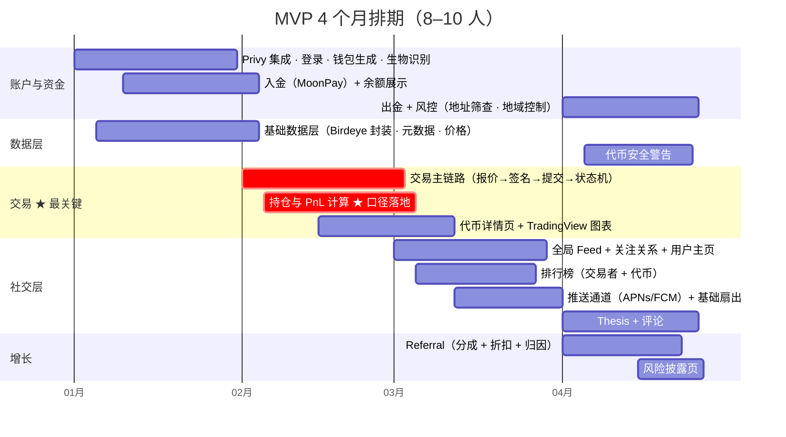

依赖关系（**关键路径是「交易 → 持仓/PnL → 社交层」**）：

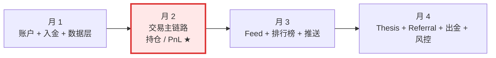

**人力配置**：

| 角色 | 人数 | 职责 |
|---|---|---|
| 移动端 | 3 | React Native，体验是核心竞争力 |
| 后端（交易） | 2 | 交易链路、状态机、钱包编排 |
| 后端（社交/数据） | 2 | Feed、排行榜、持仓 PnL、数据层 |
| 产品设计 | 1–2 | 交互 + 视觉。这类产品设计权重极高 |
| 运营/增长 | 1 | 种子 KOL 谈判、内容准备 |

### 阶段 2：内测与 PMF 验证（2 个月）

**目标：100–500 个真实用户，验证社交层是否成立。**

| 任务 | 说明 |
|---|---|
| 种子 KOL 引入 | **10–30 个中腰部交易 KOL**（粉丝 1 万–10 万），给定制分成 30%+ 和数据看板 |
| 冷启动内容 | 这批 KOL 的交易本身就是初始 Feed |
| 指标埋点上线 | 见下方「必须埋的指标」 |
| 执行质量优化 | 卖出失败率、端到端延迟、交易成功率 |
| 客服与事故响应 | 应用内客服；状态页 |

**PMF 判定标准**（缺一个就不要往下走）：

| 指标 | 门槛 |
|---|---|
| **Feed 来源交易占比** | >30%（如果和搜索差不多，社交层是装饰） |
| **非交易日活占比** | >20%（用户在不交易的日子会打开 App —— 这是「社交」成立的唯一硬证据） |
| **D7 留存** | >25% |
| **人均关注数** | 中位数 >3 |
| **带 Thesis 的交易占比** | >5% |
| **卖出成功率** | >98% |

### 阶段 3：多链 + 增长（3 个月）

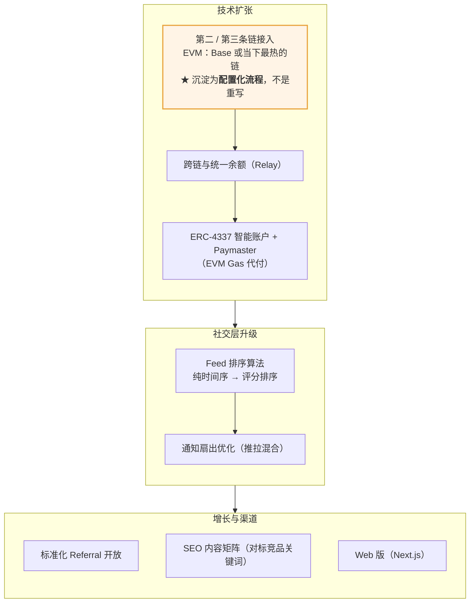

### 阶段 4：护城河深化（持续）

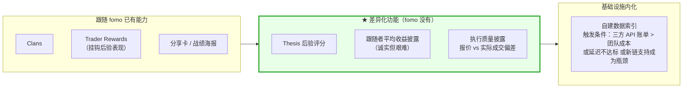

### 阶段 5：资产扩张（可选）

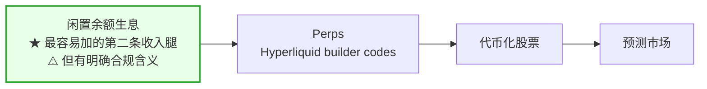

---

## 5. 关键工程细节清单

这些是最容易被低估、但一定会出问题的地方。

### 5.1 交易状态机（必做）

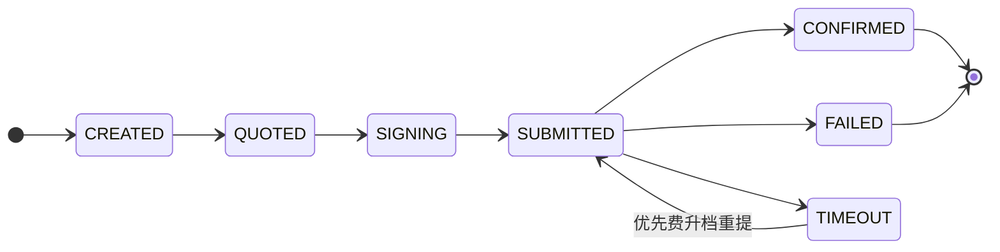

完整版见 [06 交易执行与跨链 · 第 7 节](06-交易执行与跨链.md#7-交易状态机自建必做)。

必须做到：
- **状态持久化** —— 服务重启不丢单
- **幂等** —— 用户连点三次只下一单（用客户端生成的幂等键）
- **超时策略** —— Solana 上交易可能长时间不确认
- **失败原因人类可读** —— 不要甩链上错误码
- **卖出比买入更保守** —— 更宽的滑点容忍、更激进的重试。卖出失败的信任损失远大于买入失败

### 5.2 Feed 扇出（推拉混合）

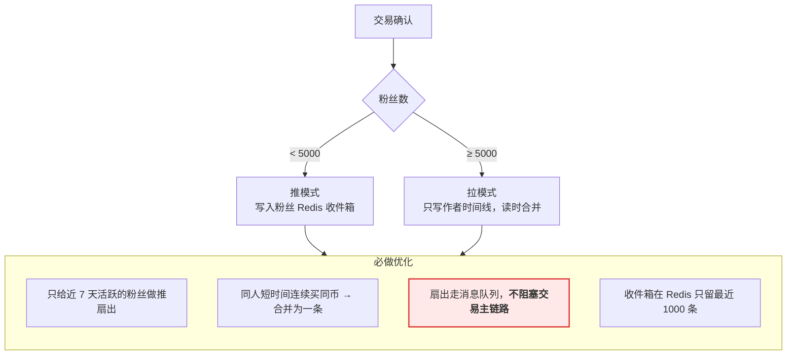

### 5.3 通知频控（必做，否则用户关通知）

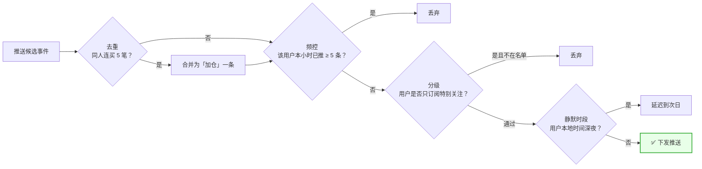

⚠️ **用户一旦关掉推送，基本不会再开。** 这是这类产品最不可逆的流失。

### 5.4 Gas 代付成本控制

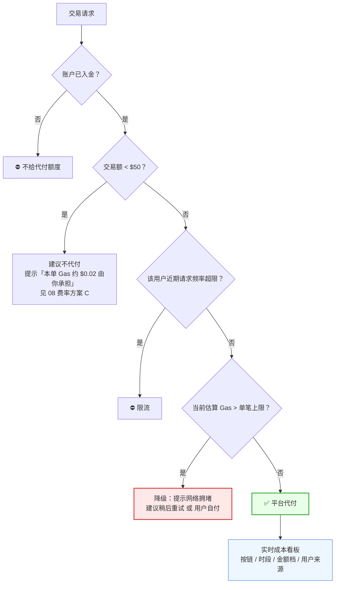

### 5.5 归因系统（Referral 和指标都依赖它）

每笔交易必须记录：
- `source`：feed / leaderboard / search / push / token_page / clan_feed
- `source_ref`：具体是哪条 Feed 项、哪个排行榜位次、哪个 Thesis
- `referral_chain`：推荐人链路

**这是衡量社交层价值的唯一方式，也是返佣对账的基础。** 后补极其痛苦，必须从第一天就埋。

---

## 6. 必须埋的指标

### 社交层价值验证（最重要）

| 指标 | 门槛/意义 |
|---|---|
| **发现→交易转化率（分来源）** | Feed 显著高于搜索才说明社交层有效 |
| **非交易日活占比** | 「社交」是否真的存在的唯一硬证据 |
| 人均关注数分布 | 关注 0 人的占比过高 = 社交层没跑通 |
| 粉丝集中度（基尼系数） | 过度集中 = 高出货流动性风险 |
| Thesis 生产率 | 内容供给健康度 |
| 评论/互动率 | 是否只有单向消费 |

### 业务健康度

| 指标 | 说明 |
|---|---|
| Cohort 留存 D1/D7/D30 | **按获取渠道分层**（KOL vs 自然） |
| 交易者/注册用户比 | fomo 唯一披露过的是约 29% |
| **跟随者平均收益** | 最重要也最不想看的数字 |
| 平均持仓时长趋势 | 持续下降 = 产品在把用户推向短期化 |
| 小额交易占比 | 关联最低费的体验问题 |
| 被推荐用户占比 | 关联毛利（被推荐用户 take rate 低 33%） |

### 技术健康度

| 指标 | 目标 |
|---|---|
| 交易成功率 | >98%（买入）/ >98%（卖出） |
| **端到端通知延迟** | **<3s**（链上确认 → 手机震动） |
| 报价 vs 实际成交偏差 | 监控并考虑对用户披露 |
| Gas 代付支出/收入比 | 设警戒线 |
| 卖出失败率（按代币流动性分层） | 定位问题代币 |

---

## 7. 直接对标 fomo 的差异化机会

fomo 的短板就是切入点：

| fomo 的问题 | 你的机会 | 难度 |
|---|---|---|
| **费率不透明**（官网不写费率） | 公开写清楚 + 费率曲线图 | 极低，零成本 |
| **$0.95 最低费惩罚小额** | 小额自付 Gas + 低费率（见 [08 方案 C](08-费用结构与商业模式.md#24-自建的四个可选方案)） | 低 |
| **无执行质量披露** | 主动展示报价 vs 实际成交偏差 | 中 |
| **现货无限价单/止损** | 支持（需要链下订单系统 + keeper） | 中高 |
| **卖出失败** | 卖出路径专项优化 | 中 |
| **Thesis 无后验评分** | 自动计算发表后 24h/7d/30d 表现 | 低 |
| **不披露跟随者收益** | 展示「跟随此人的用户平均收益」 | 中（数据易算，决策难做） |
| **无捆绑钱包检测** | 集成或自建检测 | 中 |
| **无 Telegram bot** | 做一个（但注意这会改变产品定位） | 中 |

### 最值得做的三个

1. **费率透明 + 小额友好的费率结构** —— 零成本，直击最大痛点
2. **Thesis 后验评分** —— 让「可验证的观点」真正可验证，这是对社交交易的实质性改进
3. **跟随者平均收益披露** —— 唯一能真正对冲出货流动性问题的产品手段。它会得罪头部用户，但会赢得普通用户的长期信任

---

## 8. 风险与失败模式

| 失败模式 | 症状 | 预防 |
|---|---|---|
| **做成了另一个交易终端** | 社交指标全线低迷，Feed 转化率和搜索差不多 | 阶段 2 的 PMF 门槛严格执行，不达标就不加功能 |
| **PnL 算错** | 排行榜被质疑，用户流失 | 口径提前定稿；上线前用真实交易做逐笔对账 |
| **卖出失败引发信任崩塌** | 应用商店评分暴跌 | 卖出路径专项优化 + 监控 + 主动补偿政策 |
| **Gas 代付成本失控** | 毛利被吃掉 | 上限 + 频控 + 实时看板 |
| **推送打扰导致大量关闭** | 推送开启率持续下降 | 从第一天就做频控和去重 |
| **KOL 分成算错** | KOL 停止推广 | 归因和对账系统一次做对 |
| **供应商单点故障** | 全站停摆 | 关键路径多供应商 + 降级策略 |
| **监管变化** | 业务模式受冲击 | 提前取得法律意见；地域控制做扎实 |
| **冷启动失败** | 没有内容、没有人可关注 | 种子 KOL 必须在上线前谈好 |

### 最大的单一风险

**冷启动。** 社交交易平台的第一个月如果 Feed 是空的、排行榜没人，产品就没有任何价值 —— 它退化成一个比竞品更差的下单器。

**种子 KOL 必须在技术上线前就谈好。** 这是运营工作，但它是产品能否启动的前提条件，优先级等同于 P0 功能。

---

## 9. 一页总结

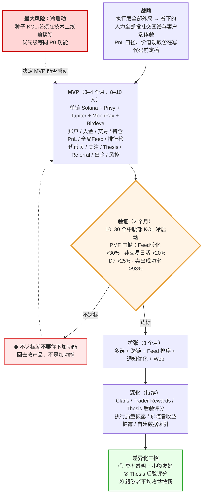

---

> 本文档中对第三方内容的引用均已改写以符合授权限制（Content was rephrased for compliance with licensing restrictions）。
