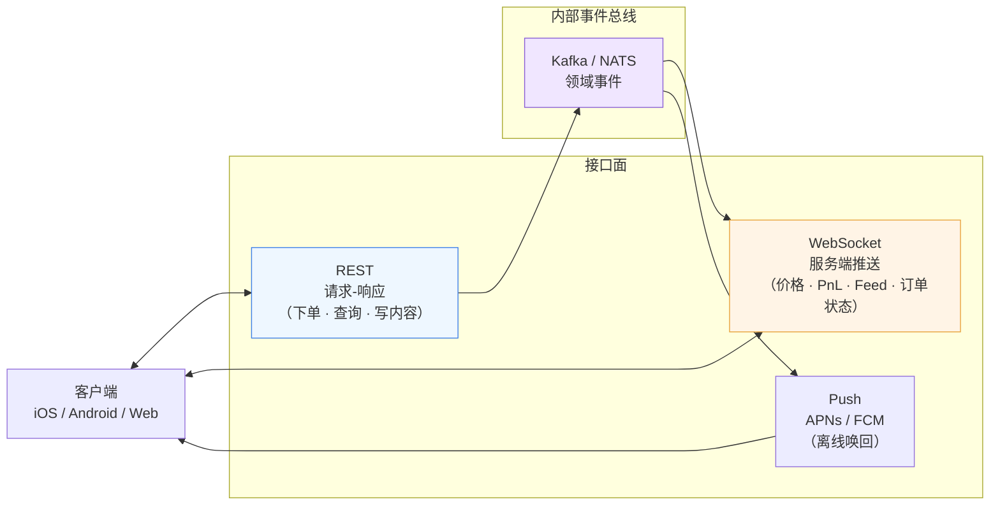
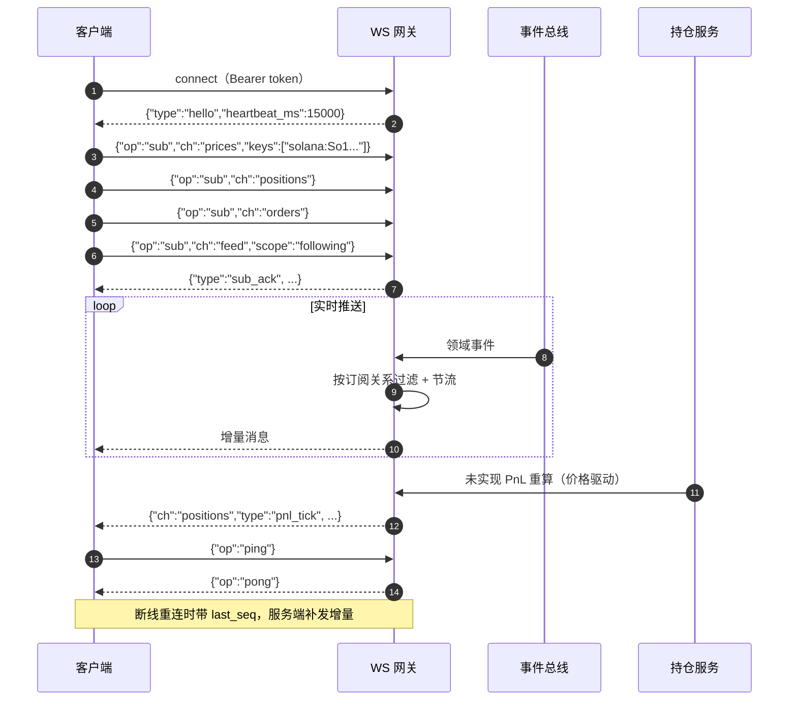
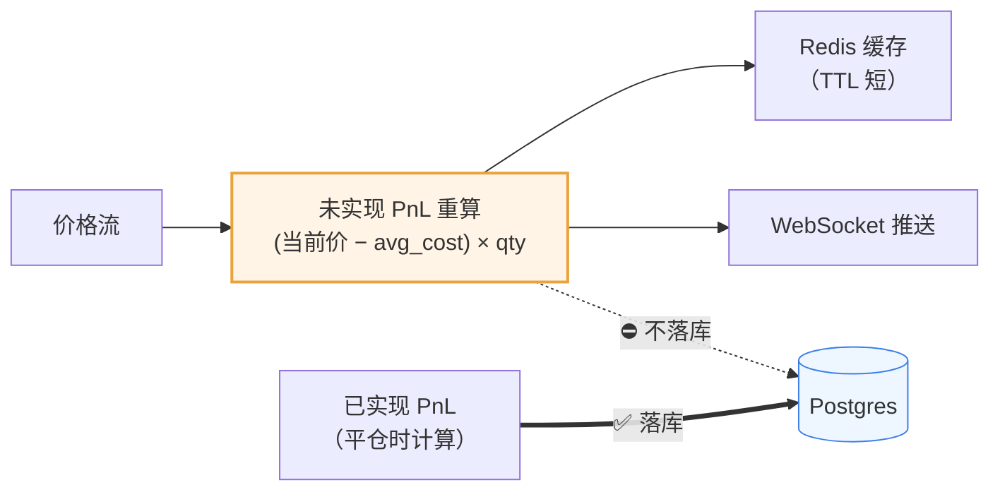
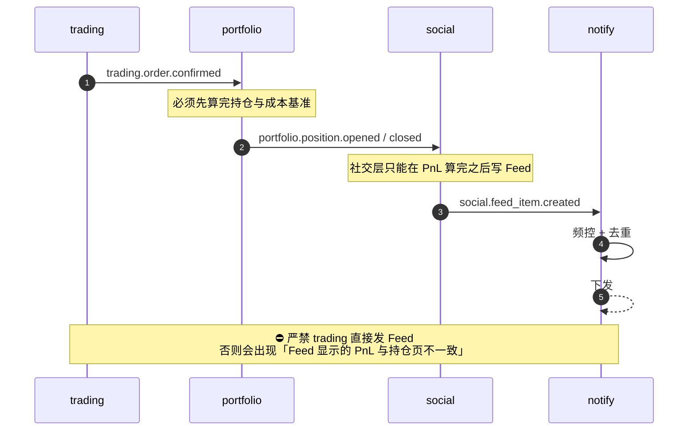
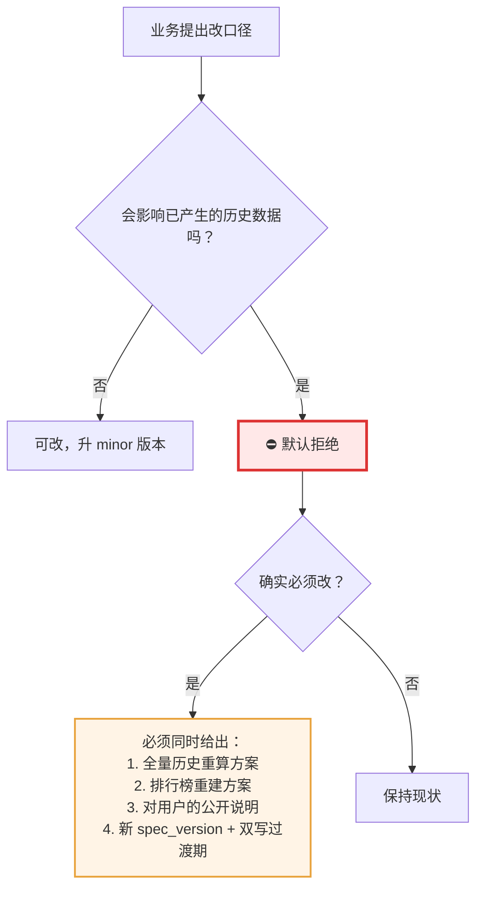
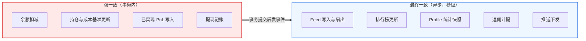
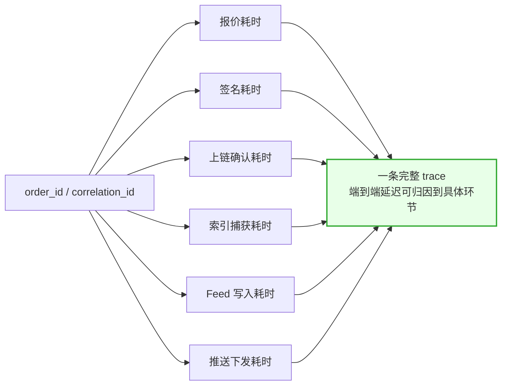

# 12 · 接口与数据契约草案

> ⚠️ 本文档**不是** fomo 的接口文档 —— fomo 没有公开 API。这里是把前 11 篇的拆解结论落成可实施的契约草案，供自建时直接开工。全文属 **[推断 / 自建设计]**。
>
> 契约先定，再写代码。这类产品最容易返工的地方是 PnL 口径、状态枚举和事件语义 —— 它们一旦上线就很难改。

---

## 1. 总览



三条通道的职责必须分清：

| 通道 | 用途 | 不该做什么 |
|---|---|---|
| **REST** | 幂等的写操作、分页查询、一次性拉取 | ⛔ 不要用轮询代替 WebSocket 拿实时价格 |
| **WebSocket** | 价格、未实现 PnL、订单状态、Feed 增量 | ⛔ 不要用它做写操作（难以保证幂等） |
| **Push** | 用户不在前台时的唤回 | ⛔ 不要把它当数据通道（可能丢，可能被系统降级） |

---

## 2. REST 接口清单

### 2.1 账户与身份

| 方法 | 路径 | 说明 |
|---|---|---|
| POST | `/v1/auth/otp/request` | 请求邮箱验证码 |
| POST | `/v1/auth/otp/verify` | 校验验证码，返回会话令牌 |
| POST | `/v1/auth/oidc/apple` | Apple ID 授权码换令牌 |
| GET | `/v1/me` | 当前用户（含钱包地址、费率标记、地域策略） |
| PATCH | `/v1/me` | 更新用户名、头像、简介 |
| GET | `/v1/me/session-policy` | **地域策略**：哪些功能对本会话可见 |
| POST | `/v1/me/biometric` | 绑定 / 解绑本设备生物识别 |
| POST | `/v1/me/export-key` | 导出私钥（**强制生物识别 + 二次确认**） |

`GET /v1/me/session-policy` 响应示例 —— **注意用「可见性」而不是「是否允许」**，客户端据此决定渲染，见 [10 地域限制](10-风险合规与安全.md#2-地域限制)：

```json
{
  "region": "US",
  "features": {
    "spot_trading": "visible",
    "perps": "hidden",
    "tokenized_equity": "hidden",
    "bank_withdrawal": "visible"
  },
  "fee_profile": {
    "spot_bps": 50,
    "spot_min_usd": "0.95",
    "referral_discount_bps": 5,
    "effective_spot_bps": 45
  }
}
```

### 2.2 资金

| 方法 | 路径 | 说明 |
|---|---|---|
| GET | `/v1/balance` | 统一美元余额（含在途跨链资金，分开列示） |
| POST | `/v1/deposits/fiat/session` | 创建法币入金会话（返回第三方 Onramp URL / SDK 参数） |
| GET | `/v1/deposits/crypto/addresses` | 各网络充值地址 + 支持币种 |
| GET | `/v1/deposits` | 入金记录（分页） |
| POST | `/v1/withdrawals` | 发起提现（**强制生物识别**） |
| GET | `/v1/withdrawals/{id}` | 提现状态 |

`GET /v1/balance` —— **在途资金必须单列**，否则用户会以为钱丢了：

```json
{
  "total_usd": "1000.00",
  "available_usd": "800.00",
  "in_transit_usd": "200.00",
  "breakdown": [
    { "chain": "solana", "usdc": "400.00" },
    { "chain": "base",   "usdc": "350.00" },
    { "chain": "bsc",    "usdc": "50.00"  }
  ],
  "in_transit": [
    { "from_chain": "base", "to_chain": "monad", "usdc": "200.00",
      "bridge": "relay", "eta_seconds": 45, "ref": "brg_01H..." }
  ]
}
```

### 2.3 行情与代币

| 方法 | 路径 | 说明 |
|---|---|---|
| GET | `/v1/tokens/search?q=` | 按名称 / 符号 / 合约地址搜索 |
| GET | `/v1/tokens/{chain}/{address}` | 代币详情（市场数据 + 安全评分 + 社交链接） |
| GET | `/v1/tokens/{chain}/{address}/holders` | Top holders + 早期买入者（含各自最新观点） |
| GET | `/v1/tokens/{chain}/{address}/candles` | K 线（供 TradingView datafeed） |
| GET | `/v1/tokens/{chain}/{address}/theses` | 该代币下的 Thesis（带 chart_timestamp） |
| GET | `/v1/discover/trending` | 精选板块：Trending / New / Verified |
| GET | `/v1/discover/new-launches` | 新盘监控 |

代币安全评分的响应结构 —— **要给出可解释的明细，不要只给一个分数**：

```json
{
  "risk_level": "warning",
  "checks": {
    "contract": {
      "mint_authority_active": true,
      "freeze_authority_active": false,
      "honeypot": false,
      "upgradeable_proxy": false
    },
    "liquidity": {
      "usd": "48200.00",
      "lp_locked": false,
      "lp_burned": false,
      "pool_count": 1
    },
    "holders": {
      "top10_pct": 42.5,
      "deployer_pct": 8.1,
      "bundled_insider_wallets": 7
    },
    "history": {
      "deployer_prior_rugs": 0
    },
    "metadata": {
      "impersonation_suspected": false,
      "socials_verified": true
    }
  },
  "reasons": [
    "mint_authority_active",
    "lp_not_locked",
    "bundled_insider_wallets_detected"
  ]
}
```

⭐ `bundled_insider_wallets` 是 fomo 目前没有的检测项，见 [10 代币风控](10-风险合规与安全.md#4-代币风控)。

### 2.4 交易

| 方法 | 路径 | 说明 |
|---|---|---|
| POST | `/v1/quotes` | 请求报价（返回 `quote_id` + 有效期） |
| POST | `/v1/orders` | 下单（**必须带 `Idempotency-Key`**） |
| GET | `/v1/orders/{id}` | 订单状态 |
| GET | `/v1/orders` | 订单历史（分页） |
| GET | `/v1/positions` | 全部持仓（跨链归集） |
| GET | `/v1/positions/{chain}/{address}` | 单个持仓明细（含成本基准） |
| GET | `/v1/portfolio/equity-curve` | 权益曲线 |

`POST /v1/quotes` 响应 —— **费用必须逐项拆开**，这是对 fomo 透明度短板的直接差异化，见 [08 费率](08-费用结构与商业模式.md)：

```json
{
  "quote_id": "qt_01H...",
  "expires_at": "2026-09-23T10:00:12Z",
  "ttl_ms": 12000,
  "side": "buy",
  "input": { "asset": "USDC", "amount_usd": "100.00" },
  "output": { "chain": "solana", "address": "So1...", "est_qty": "238095.2" },
  "price": { "est_execution_price": "0.00042", "price_impact_bps": 37 },
  "route": { "aggregator": "jupiter", "hops": 2, "bridge": null },
  "fees": {
    "platform_usd": "0.95",
    "platform_rule": "min_fee_applied",
    "platform_effective_bps": 95,
    "network_gas_usd": "0.02",
    "network_gas_payer": "platform",
    "third_party_usd": "0.00",
    "total_usd": "0.95"
  },
  "slippage_bps": 150,
  "warnings": ["token_risk_warning"]
}
```

注意三个字段的设计意图：

| 字段 | 为什么必须有 |
|---|---|
| `platform_rule` | 明确告诉用户「这笔是按最低费收的」，而不是让他自己算出 9.5% |
| `platform_effective_bps` | 实际费率。小额交易时这个数字很刺眼 —— **但刺眼是诚实的代价** |
| `network_gas_payer` | 如果采用 [08 方案 C](08-费用结构与商业模式.md#24-自建的四个可选方案)（小额自付 Gas），这里会是 `user` |

`POST /v1/orders` 请求：

```json
{
  "quote_id": "qt_01H...",
  "max_slippage_bps": 150,
  "acknowledge_risk": true,
  "source": "feed",
  "source_ref": "feed_item_01H..."
}
```

- `Idempotency-Key` 放在 HTTP 头，客户端生成 UUID。**同一个 key 重复提交必须返回同一个订单**，见 [06 交易状态机](06-交易执行与跨链.md#7-交易状态机自建必做)。
- `source` / `source_ref` 是归因字段，**这是衡量社交层价值的唯一方式**，不能后补。

### 2.5 社交

| 方法 | 路径 | 说明 |
|---|---|---|
| GET | `/v1/feed?scope=global\|following\|clan\|token` | Feed（游标分页） |
| GET | `/v1/users/{handle}` | 用户主页（统计快照 + 权益曲线 + 平均持仓时长） |
| GET | `/v1/users/{handle}/trades` | 某人的交易历史 |
| POST | `/v1/users/{handle}/follow` | 关注 / 取关（含 `notify_on`） |
| GET | `/v1/leaderboards?subject=trader\|token\|clan&window=24h\|7d\|30d` | 排行榜 |
| POST | `/v1/theses` | 发布 Thesis（关联 `trade_id` + `chart_timestamp`） |
| GET | `/v1/theses/{id}/performance` | ⭐ **Thesis 后验评分**（24h/7d/30d 价格变化） |
| POST | `/v1/comments` | 发布评论（支持 `parent_id` 树形） |
| POST | `/v1/comments/{id}/reactions` | 表情回应 |
| GET/POST | `/v1/clans` | Clan 列表 / 创建 |
| POST | `/v1/clans/{id}/members` | 加入（校验「一人仅一个 Clan」） |
| POST | `/v1/share-cards` | 生成分享卡 |

Feed item 响应 —— **`payload` 是写时快照**，避免读时多表 join：

```json
{
  "id": "feed_01H...",
  "type": "position_closed",
  "created_at": "2026-09-23T09:58:41Z",
  "actor": {
    "handle": "someone",
    "avatar_url": "...",
    "clan": { "id": "cl_01H...", "name": "..." },
    "credibility": {
      "leaderboard_rank_7d": 18,
      "avg_hold_seconds": 172800,
      "win_rate": 0.41,
      "follower_avg_return_pct": -8.2
    }
  },
  "token": { "chain": "solana", "symbol": "TOAD", "risk_level": "ok" },
  "payload": {
    "entry_price": "0.00031",
    "exit_price": "0.00042",
    "position_usd": "12400.00",
    "realized_pnl_usd": "4240.00",
    "realized_pnl_pct": 34.2,
    "hold_seconds": 93600
  },
  "thesis": { "id": "th_01H...", "excerpt": "持仓分布很干净，前十不到 15%" },
  "engagement": { "likes": 128, "comments": 34 },
  "disclosure": "本记录仅反映该账户通过本平台的交易，不代表其完整仓位"
}
```

⭐ 两个字段值得单独说：

- **`actor.credibility.follower_avg_return_pct`** —— 跟随此人的用户平均收益。这个数字大概率是负的，而这正是用户需要知道的。fomo 没有这个字段。见 [07 出货流动性](07-社交图谱与数据体系.md#8-社交层的结构性风险必须在设计阶段就处理)。
- **`disclosure`** —— 多钱包操纵在技术上无法解决，唯一诚实的应对是在每条 Feed 上带这句话。见 [10 透明度问题](10-风险合规与安全.md#5-社交交易特有的风险)。

### 2.6 增长

| 方法 | 路径 | 说明 |
|---|---|---|
| GET | `/v1/referral/me` | 我的推荐码 + 已获返佣 + 被推荐用户数 |
| POST | `/v1/referral/bind` | 注册时绑定推荐码 |
| GET | `/v1/referral/earnings` | 返佣明细（**必须可逐笔对账**） |
| GET | `/v1/rewards/trader` | Trader Rewards 明细 |

⚠️ `/v1/referral/earnings` 必须做到逐笔可查、可申诉。算错一次 KOL 就不推了，见 [09 增长](09-增长飞轮与运营机制.md#3-referral25-分成的杀伤力)。

---

## 3. WebSocket 契约

### 3.1 订阅模型



### 3.2 频道清单

| 频道 | 消息类型 | 节流建议 |
|---|---|---|
| `prices` | `price_tick` | 每标的 ≤ 4 次/秒，合并最新值 |
| `positions` | `pnl_tick`、`position_opened`、`position_closed` | 每秒 1 次聚合 |
| `orders` | `order_status` | 状态变化即推，不节流 |
| `feed` | `feed_item`、`feed_item_update` | 每秒 ≤ 5 条，超出走「有 N 条新内容」提示 |
| `notifications` | `alert` | 走推送频控规则 |

⚠️ **`prices` 和 `feed` 必须节流。** 热门 Memecoin 的价格变化频率会打爆客户端渲染，而 Feed 不节流会让用户眼花。

### 3.3 未实现 PnL 只推不存



原因：未实现 PnL 是价格的函数，每秒都在变。落库既无意义又是写放大灾难。**只有已实现 PnL 才是事实。**

---

## 4. 内部事件契约

服务间解耦靠事件。事件命名 `<domain>.<entity>.<past_tense_verb>`。

| 事件 | 发布者 | 主要消费者 |
|---|---|---|
| `identity.user.created` | identity | social（建图谱节点）、growth（绑定推荐关系） |
| `funding.deposit.credited` | funding | notify、portfolio |
| `funding.withdrawal.completed` | funding | notify |
| `trading.order.submitted` | trading | — |
| `trading.order.confirmed` | trading | portfolio、growth（返佣计提） |
| `trading.order.failed` | trading | notify（**可读失败原因**） |
| `portfolio.position.opened` | portfolio | social |
| `portfolio.position.closed` | portfolio | social（**含已实现 PnL**）、leaderboard |
| `social.feed_item.created` | social | notify（扇出） |
| `social.thesis.created` | social | rewards（Trader Rewards 计算） |
| `market.token.risk_changed` | market | notify（已持仓用户）、social（Feed 降权） |

事件信封统一格式：

```json
{
  "event_id": "evt_01H...",
  "type": "portfolio.position.closed",
  "occurred_at": "2026-09-23T09:58:41.123Z",
  "version": 1,
  "actor_id": "usr_01H...",
  "correlation_id": "ord_01H...",
  "payload": { "...": "..." }
}
```

三条硬规则：

1. **消费者必须幂等**，按 `event_id` 去重。至少一次投递是常态。
2. **`version` 只增不改语义**。加字段可以，改字段含义要发新 version。
3. **`correlation_id` 贯穿整条链路**，从下单一路带到推送 —— 排查「用户说卖不出去」全靠它。

### 关键事件的时序约束



**这条约束是从 fomo 的实际投诉（PnL 不准）反推出来的。** 只要允许 trading 绕过 portfolio 直接写 Feed，两处数字迟早不一致。

---

## 5. 核心枚举（一次定死）

### 5.1 订单状态

见 [06 交易状态机](06-交易执行与跨链.md#7-交易状态机自建必做)。枚举值：

```text
created | quoted | requote | signing | submitted
| confirmed | partial | failed | timeout | bumping | cancelled
```

### 5.2 Feed item 类型

```text
buy | sell | position_closed | thesis_created
| clan_joined | perp_opened | perp_closed | milestone
```

⚠️ `sell` 和 `position_closed` **必须区分**。部分减仓和完全清仓对跟随者的含义完全不同 —— 后者才是退出信号。

### 5.3 交易来源（归因）

```text
feed | following_feed | clan_feed | token_feed
| leaderboard | search | push | share_card | direct
```

### 5.4 代币风险等级

```text
ok | warning | high_risk | blocked
```

`blocked` 是 fomo 没有的一档 —— 对确认的蜜罐不应该还提供买入按钮。

### 5.5 费用规则标记

```text
percentage_applied | min_fee_applied | promo_applied
```

用于在报价里告诉用户「这笔是按哪条规则收的」。

---

## 6. PnL 口径的契约化表达

**这是本仓库最需要签字定稿的一页。** 口径写进代码注释不够，要写成契约文档并版本化。

```yaml
pnl_spec_version: 1
cost_basis_method: weighted_average   # 不用 FIFO / LIFO
include_platform_fee: true            # 手续费计入成本
include_network_gas: false            # 平台代付的 Gas 不计入用户成本
price_source: onchain_executed        # 用链上实际成交价，不用报价
cross_chain_position_merge: false     # 同代币不同链算不同资产
airdrop_cost_basis: zero_flagged      # 空投成本记 0，但单独标记为非交易获得
partial_sell_allocation: proportional # 按加权平均成本比例扣减
realized_pnl_formula: "sell_usd - sell_fee - (avg_cost * sell_qty)"
unrealized_pnl_formula: "(current_price - avg_cost) * qty"
persist_unrealized: false             # 未实现 PnL 只缓存不落库
```

### 变更约束



原因：PnL 是**公开排行榜的排序依据**。改口径会让所有历史排名失真，而用户看得见。

---

## 7. 幂等与一致性约定

### 7.1 幂等边界

| 操作 | 幂等键来源 | 重复提交的行为 |
|---|---|---|
| 下单 | 客户端生成 `Idempotency-Key` | 返回同一个订单，不新建 |
| 关注 / 取关 | `(follower_id, followee_id)` 唯一约束 | 幂等 upsert |
| 发布 Thesis | 客户端 `Idempotency-Key` | 返回已有 Thesis |
| 提现 | 客户端 `Idempotency-Key` + 服务端二次确认 | 返回同一笔，**绝不重复出金** |
| 返佣计提 | `event_id` 去重 | 只计一次 |
| 推送下发 | `(user_id, dedupe_key)` | 窗口内不重发 |

### 7.2 一致性分级



判定原则：**碰钱的强一致，碰社交的最终一致。** 排行榜晚 5 秒没人会投诉，余额算错一次就是事故。

---

## 8. 错误契约

失败原因必须人类可读，这是从 fomo 的「卖不出去」投诉直接得出的要求。

```json
{
  "error": {
    "code": "ORDER_SLIPPAGE_EXCEEDED",
    "http_status": 422,
    "message_user": "价格变动超出你设置的范围，这笔交易未成交，资金已退回。",
    "message_debug": "expected 0.00042, executed would be 0.00051, slippage 214bps > 150bps",
    "retriable": true,
    "suggested_action": "requote",
    "correlation_id": "ord_01H..."
  }
}
```

核心错误码建议：

| 错误码 | 用户侧文案方向 | 可重试 |
|---|---|---|
| `QUOTE_EXPIRED` | 报价已过期，正在重新询价 | ✅ 自动 |
| `ORDER_SLIPPAGE_EXCEEDED` | 价格变动超出范围，资金已退回 | ✅ |
| `NETWORK_CONGESTED` | 网络拥堵，未成交，资金已退回 | ✅ |
| `INSUFFICIENT_LIQUIDITY` | 这个代币当前流动性不足，建议减小金额 | ⚠️ 需调整 |
| `TOKEN_BLOCKED` | 该代币被检测为高风险，已暂停交易 | ❌ |
| `FEATURE_NOT_AVAILABLE_IN_REGION` | 该功能在你所在地区不可用 | ❌ |
| `BIOMETRIC_REQUIRED` | 需要面容 / 指纹验证 | ✅ |
| `GAS_SPONSORSHIP_UNAVAILABLE` | 网络费用异常偏高，可稍后重试或选择自付 | ✅ |

⛔ **绝不要把链上错误码或 `revert` 数据直接返回给用户。**

---

## 9. 观测性契约

每条链路都要能回答「用户说的那笔到底怎么了」。



必须打点的指标（对应 [11 必须埋的指标](11-自建路线图与技术选型.md#6-必须埋的指标)）：

| 指标 | 维度 |
|---|---|
| 订单成功率 | 按 side（买/卖）× 链 × 代币流动性分档 |
| 端到端通知延迟 P50/P95/P99 | 按链 |
| 报价 vs 实际成交偏差 | 按聚合器 × 金额档 |
| Gas 代付支出 | 按链 × 时段 × 金额档 × 用户来源 |
| 卖出失败率 | 按代币流动性分层 ⭐ |
| Feed 来源转化率 | 按 `source` 枚举 ⭐ |

⭐ 标记的两项是 fomo 的问题所在与社交层价值的验证口，优先级最高。

---

## 10. 开工检查清单

在写第一行业务代码前，这些应该已经定稿：

```text
□ PnL spec（yaml 已签字，含 version）
□ 订单状态枚举 + 状态机图
□ Feed item 类型枚举（sell 与 position_closed 已区分）
□ 归因枚举（source / source_ref 字段已进 Trade 表设计）
□ 事件信封格式 + 命名规范
□ 一致性分级（哪些强一致、哪些最终一致）
□ 幂等键策略（下单 / 提现 / 返佣）
□ 错误码表 + 用户侧文案
□ 地域策略响应格式（visible / hidden 而非 allow / deny）
□ 费用拆项格式（platform_rule / effective_bps / gas_payer）
□ 风险披露文案（Feed 级 disclosure 字段）
□ 价值观取舍表（见 11 · 前提三）
```

---

> 本文档为自建设计草案，非 fomo 官方接口。涉及第三方内容的引用均已改写并标注来源（Content was rephrased for compliance with licensing restrictions）。
